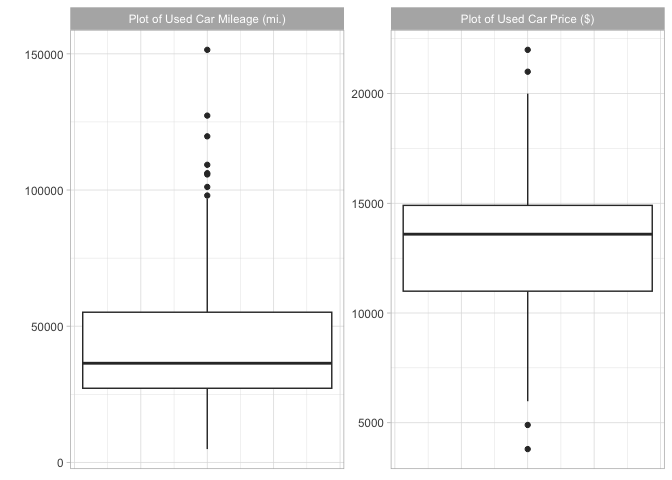

# chapter 2, Managing & Understanding Data
jason grahn

## Chapter 2

``` r
library(tidyverse)
```

    ── Attaching core tidyverse packages ──────────────────────── tidyverse 2.0.0 ──
    ✔ dplyr     1.1.3     ✔ readr     2.1.4
    ✔ forcats   1.0.0     ✔ stringr   1.5.0
    ✔ ggplot2   3.4.4     ✔ tibble    3.2.1
    ✔ lubridate 1.9.3     ✔ tidyr     1.3.0
    ✔ purrr     1.0.2     
    ── Conflicts ────────────────────────────────────────── tidyverse_conflicts() ──
    ✖ dplyr::filter() masks stats::filter()
    ✖ dplyr::lag()    masks stats::lag()
    ℹ Use the conflicted package (<http://conflicted.r-lib.org/>) to force all conflicts to become errors

``` r
subject_name <- c("John Doe", "Jane Doe", "Steve Graves")
temperature <- c(98.1, 98.6, 101.4)
flu_status <- c(FALSE, FALSE, TRUE)

fever <- temperature > 100
subject_name[fever]
```

\[1\] “Steve Graves”

``` r
gender <- factor(c("MALE", "FEMALE", "MALE"))

blood <- factor(c("O", "AB", "A"),
                levels = c("A", "B", "AB", "O"))
blood
```

\[1\] O AB A Levels: A B AB O

``` r
symptoms <- factor(c("SEVERE", "MILD", "MODERATE"),
                   levels = c("MILD", "MODERATE", "SEVERE"),
                   ordered = TRUE)

# make it a list
subject1 <- list(fullname = subject_name[1],
                 temperature = temperature[1],
                 flu_status = flu_status[1],
                 gender = gender[1],
                 blood = blood[1],
                 symptoms = symptoms[1])

#make it a DF
pt_data <- data.frame(subject_name, temperature, flu_status, gender, blood, symptoms)

pt_data
```

subject_name temperature flu_status gender blood symptoms 1 John Doe
98.1 FALSE MALE O SEVERE 2 Jane Doe 98.6 FALSE FEMALE AB MILD 3 Steve
Graves 101.4 TRUE MALE A MODERATE

Of course, columns are better accessed by name rather than position, and
negative signs can be used to exclude rows or columns of data.
Therefore, the output of the command:

``` r
pt_data[c(1, 3), c("temperature", "gender")]
```

temperature gender 1 98.1 MALE 3 101.4 MALE

… Is the same as…

``` r
pt_data |> 
    filter(str_detect(subject_name, 'Doe') == TRUE) %>% 
    select(temperature, gender) 
```

temperature gender 1 98.1 MALE 2 98.6 FEMALE

adding a new column to a data frame

``` r
pt_data$temp_c <- (pt_data$temperature - 32) * (5 / 9)

# is the same as 

pt_data %>% 
    mutate(temp_c = (temperature - 32) * (5/9))
```

subject_name temperature flu_status gender blood symptoms temp_c 1 John
Doe 98.1 FALSE MALE O SEVERE 36.72222 2 Jane Doe 98.6 FALSE FEMALE AB
MILD 37.00000 3 Steve Graves 101.4 TRUE MALE A MODERATE 38.55556

# Matrices and arrays

``` r
m <- matrix(c(1, 2, 3, 4), nrow = 2)
m
```

     [,1] [,2]

\[1,\] 1 3 \[2,\] 2 4

``` r
save(pt_data, file = "mydata.RData")

load("mydata.RData")

#saveRDS(my_model, file = "my_model.rds")
ls()
```

\[1\] “blood” “fever” “flu_status” “gender”  
\[5\] “has_annotations” “m” “pt_data” “subject_name”  
\[9\] “subject1” “symptoms” “temperature”

``` r
#rm(m, subject1)

ls()
```

\[1\] “blood” “fever” “flu_status” “gender”  
\[5\] “has_annotations” “m” “pt_data” “subject_name”  
\[9\] “subject1” “symptoms” “temperature”

# Importing and saving datasets from CSV files

importing is pretty easy in both standard and tidy formats

``` r
pt_data <- read.csv(here::here("02_managing_data", "data", "pt_data.csv"),
                    stringsAsFactors = TRUE)

pt_data_tidy <- read_csv(here::here("02_managing_data", "data", "pt_data.csv")) %>% 
    janitor::clean_names()
```

    Rows: 3 Columns: 5
    ── Column specification ────────────────────────────────────────────────────────
    Delimiter: ","
    chr (3): subject_name, gender, blood_type
    dbl (1): temperature
    lgl (1): flu_status

    ℹ Use `spec()` to retrieve the full column specification for this data.
    ℹ Specify the column types or set `show_col_types = FALSE` to quiet this message.

``` r
pt_data_tidy
```

# A tibble: 3 × 5

subject_name temperature flu_status gender blood_type <chr> <dbl> <lgl>
<chr> <chr>  
1 John Doe 98.1 FALSE MALE O  
2 Jane Doe 98.6 FALSE FEMALE AB  
3 Steve Graves 101. TRUE MALE A

writing..

``` r
write.csv(pt_data, file = here::here("02_managing_data", "data", "pt_data_write.csv"), 
          row.names = FALSE)

write_csv(pt_data_tidy, file = here::here("02_managing_data", "data", "pt_data_tidy.csv"))
```

# Exploring and understanding data

using the **“usedcars.csv”** dataset..

``` r
used_cars_tidy <- read_csv(here::here("02_managing_data", "data", "usedcars.csv")) %>% 
    janitor::clean_names()
```

    Rows: 150 Columns: 6
    ── Column specification ────────────────────────────────────────────────────────
    Delimiter: ","
    chr (3): model, color, transmission
    dbl (3): year, price, mileage

    ℹ Use `spec()` to retrieve the full column specification for this data.
    ℹ Specify the column types or set `show_col_types = FALSE` to quiet this message.

## exploring the structure

``` r
glimpse(used_cars_tidy)
```

Rows: 150 Columns: 6 \$ year <dbl> 2011, 2011, 2011, 2011, 2012, 2010,
2011, 2010, 2011, 201… \$ model <chr> “SEL”, “SEL”, “SEL”, “SEL”, “SE”,
“SEL”, “SEL”, “SEL”, “S… \$ price <dbl> 21992, 20995, 19995, 17809,
17500, 17495, 17000, 16995, 1… \$ mileage <dbl> 7413, 10926, 7351,
11613, 8367, 25125, 27393, 21026, 3265… \$ color <chr>”Yellow”, “Gray”,
“Silver”, “Gray”, “White”, “Silver”, “B… \$ transmission <chr>”AUTO”,
“AUTO”, “AUTO”, “AUTO”, “AUTO”, “AUTO”, “AUTO”, “…

The book uses base R “summary” but I like the `psych::describe` function
a lot more for doing the same thing.

``` r
summary(used_cars_tidy)
```

      year         model               price          mileage      

Min. :2000 Length:150 Min. : 3800 Min. : 4867  
1st Qu.:2008 Class :character 1st Qu.:10995 1st Qu.: 27200  
Median :2009 Mode :character Median :13592 Median : 36385  
Mean :2009 Mean :12962 Mean : 44261  
3rd Qu.:2010 3rd Qu.:14904 3rd Qu.: 55124  
Max. :2012 Max. :21992 Max. :151479  
color transmission  
Length:150 Length:150  
Class :character Class :character  
Mode :character Mode :character

``` r
psych::describe(used_cars_tidy) 
```

              vars   n     mean       sd  median  trimmed      mad  min    max

year 1 150 2008.73 2.20 2009.0 2009.09 1.48 2000 2012 model\* 2 150 1.81
0.90 1.0 1.76 0.00 1 3 price 3 150 12961.93 3122.48 13591.5 13128.98
2377.35 3800 21992 mileage 4 150 44260.65 26982.10 36385.0 41039.59
18364.22 4867 151479 color\* 5 150 4.60 2.66 6.0 4.60 2.97 1 9
transmission\* 6 150 1.15 0.35 1.0 1.06 0.00 1 2 range skew kurtosis se
year 12 -2.02 4.69 0.18 model\* 2 0.39 -1.67 0.07 price 18192 -0.42 0.43
254.95 mileage 146612 1.23 1.50 2203.08 color\* 8 -0.19 -1.52 0.22
transmission\* 1 1.98 1.92 0.03

more specific now..

``` r
summary(used_cars_tidy[c("price", "mileage")])
```

     price          mileage      

Min. : 3800 Min. : 4867  
1st Qu.:10995 1st Qu.: 27200  
Median :13592 Median : 36385  
Mean :12962 Mean : 44261  
3rd Qu.:14904 3rd Qu.: 55124  
Max. :21992 Max. :151479

``` r
used_cars_tidy %>% 
    select(price, mileage) %>% 
    psych::describe()
```

        vars   n     mean       sd  median  trimmed      mad  min    max  range

price 1 150 12961.93 3122.48 13591.5 13128.98 2377.35 3800 21992 18192
mileage 2 150 44260.65 26982.10 36385.0 41039.59 18364.22 4867 151479
146612 skew kurtosis se price -0.42 0.43 254.95 mileage 1.23 1.50
2203.08

``` r
range(used_cars_tidy$price)
```

\[1\] 3800 21992

``` r
# or again we can use describe, but describe doesn't like working with just 1 variable! 

used_cars_tidy %>% 
    select(price, year) %>% 
    psych::describe()
```

      vars   n     mean      sd  median  trimmed     mad  min   max range  skew

price 1 150 12961.93 3122.48 13591.5 13128.98 2377.35 3800 21992 18192
-0.42 year 2 150 2008.73 2.20 2009.0 2009.09 1.48 2000 2012 12 -2.02
kurtosis se price 0.43 254.95 year 4.69 0.18

Combining range() with the difference function diff() allows you to
compute the range statistic with a single line of code:

``` r
diff(range(used_cars_tidy$price))
```

\[1\] 18192

But we could have achieved the same results from looking at the `range`
variable within psych::describe…

We dont get the Interquartile range of `price` from describe though, not
without calculating it.

``` r
IQR(used_cars_tidy$price)
```

\[1\] 3909.5

``` r
quantile(used_cars_tidy$price)
```

     0%     25%     50%     75%    100% 

3800.0 10995.0 13591.5 14904.5 21992.0

or we can supply arguments to get specific percentiles…

``` r
quantile(used_cars_tidy$price, probs = c(0.01, 0.99))
```

      1%      99% 

5428.69 20505.00

``` r
# and in tidy format..

used_cars_tidy %>% 
    select(price) %>% 
    summarize(p01 = quantile(price,.01),
              p99 = quantile(price,.99))
```

# A tibble: 1 × 2

    p01   p99

<dbl> <dbl> 1 5429. 20505

and they emphasize sequencing, which, to be fair, i should do more
often. Directly Replicating the base-R quantile process in Tidy doesn’t
look great. There’s probably a better way to do this?

``` r
quantile(used_cars_tidy$price, seq(from = 0, 
                                   to = 1, 
                                   by = .20))
```

     0%     20%     40%     60%     80%    100% 

3800.0 10759.4 12993.8 13992.0 14999.0 21992.0

``` r
used_cars_tidy %>% 
    select(price) %>% 
    summarize(percentiles = quantile(price,
                                     seq(from = 0, 
                                         to = 1, 
                                         by = .20)))
```

    Warning: Returning more (or less) than 1 row per `summarise()` group was deprecated in
    dplyr 1.1.0.
    ℹ Please use `reframe()` instead.
    ℹ When switching from `summarise()` to `reframe()`, remember that `reframe()`
      always returns an ungrouped data frame and adjust accordingly.

# A tibble: 6 × 1

percentiles <dbl> 1 3800 2 10759. 3 12994. 4 13992 5 14999 6 21992

Oh.. this is MUCH better:
https://stackoverflow.com/questions/30488389/using-dplyr-window-functions-to-calculate-percentiles.

``` r
used_cars_tidy %>% 
    summarize(enframe(quantile(price, seq(from = 0, to = 1, by = .20)), "quantile", "price"))
```

    Warning: Returning more (or less) than 1 row per `summarise()` group was deprecated in
    dplyr 1.1.0.
    ℹ Please use `reframe()` instead.
    ℹ When switching from `summarise()` to `reframe()`, remember that `reframe()`
      always returns an ungrouped data frame and adjust accordingly.

# A tibble: 6 × 2

quantile price <chr> <dbl> 1 0% 3800 2 20% 10759. 3 40% 12994. 4 60%
13992 5 80% 14999 6 100% 21992

# Visualizing numeric features – boxplots

I dont particularly like the base R boxplots, so this will be
interesting.

``` r
boxplot(used_cars_tidy$price, 
        main = "Boxplot of Used Car Prices",
        ylab = "Price ($)")
```


``` r
boxplot(used_cars_tidy$mileage, 
        main = "Boxplot of Used Car Mileage",
        ylab = "Odometer (mi.)")
```


``` r
used_cars_tidy %>% 
    select(price, mileage) %>% 
    pivot_longer(names_to = "key",
                 values_to = "values",
                 cols = 1:2) %>% 
    mutate(box_labels = case_when(key == 'mileage' ~ 'Plot of Used Car Mileage (mi.)',
                                  key == 'price' ~ 'Plot of Used Car Price ($)')) %>% 
    ggplot(aes(y = values)) + 
    geom_boxplot() + 
    facet_wrap(~box_labels,
               scales = 'free_y') + 
    theme_light() + 
    theme(axis.title.x=element_blank(),
          axis.text.x=element_blank(),
          axis.ticks.x=element_blank()) + 
    labs(y = "")
```



This chapter goes on to talk about histograms, skewness, variance,
standard deviations, and other base statistics.

Then we talk about building scatterplots to evaluate relationships
between variables. Then we get into using the `gmodels` package to
evaluate the strength of those relationships.

# Examining relationships – two-way cross-tabulations

``` r
library(gmodels)
```

``` r
used_cars_tidy <- 
    used_cars_tidy %>% 
    mutate(conservative = color %in% c("Black", "Gray", "Silver", "White"))
```

``` r
table(used_cars_tidy$conservative)
```

FALSE TRUE 51 99

``` r
gmodels::CrossTable(x = used_cars_tidy$model, y = used_cars_tidy$conservative)
```

Cell Contents \|————————-\| \| N \| \| Chi-square contribution \| \| N /
Row Total \| \| N / Col Total \| \| N / Table Total \| \|————————-\|

Total Observations in Table: 150

                     | used_cars_tidy$conservative 

| used_cars_tidy\$model | FALSE | TRUE  | Row Total |
|-----------------------|-------|-------|-----------|
| SE                    | 27    | 51    | 78        |
| 0.009                 | 0.004 |       |           |
| 0.346                 | 0.654 | 0.520 |           |
| 0.529                 | 0.515 |       |           |
| 0.180                 | 0.340 |       |           |
| ———————               | ———–  | ———–  | ———–      |
| SEL                   | 7     | 16    | 23        |
| 0.086                 | 0.044 |       |           |
| 0.304                 | 0.696 | 0.153 |           |
| 0.137                 | 0.162 |       |           |
| 0.047                 | 0.107 |       |           |
| ———————               | ———–  | ———–  | ———–      |
| SES                   | 17    | 32    | 49        |
| 0.007                 | 0.004 |       |           |
| 0.347                 | 0.653 | 0.327 |           |
| 0.333                 | 0.323 |       |           |
| 0.113                 | 0.213 |       |           |
| ———————               | ———–  | ———–  | ———–      |
| Column Total          | 51    | 99    | 150       |
| 0.340                 | 0.660 |       |           |
| ———————               | ———–  | ———–  | ———–      |

The book says to add up all the chi-square contributions to do a fit
test. Sure, though I’m sure there’s a *better* way out there somewhere.
Anyway.

``` r
chi_sq <- 0.009 + .004 + .086 +.044 + .007 + 0.004
chi_sq
```

\[1\] 0.154

``` r
pch <- pchisq(chi_sq, df = 2, lower.tail = FALSE)
pch
```

\[1\] 0.9258899

``` r
# which matches the book. 
```

``` r
CrossTable(x = used_cars_tidy$model, y = used_cars_tidy$conservative, chisq = TRUE)
```

Cell Contents \|————————-\| \| N \| \| Chi-square contribution \| \| N /
Row Total \| \| N / Col Total \| \| N / Table Total \| \|————————-\|

Total Observations in Table: 150

                     | used_cars_tidy$conservative 

| used_cars_tidy\$model | FALSE | TRUE  | Row Total |
|-----------------------|-------|-------|-----------|
| SE                    | 27    | 51    | 78        |
| 0.009                 | 0.004 |       |           |
| 0.346                 | 0.654 | 0.520 |           |
| 0.529                 | 0.515 |       |           |
| 0.180                 | 0.340 |       |           |
| ———————               | ———–  | ———–  | ———–      |
| SEL                   | 7     | 16    | 23        |
| 0.086                 | 0.044 |       |           |
| 0.304                 | 0.696 | 0.153 |           |
| 0.137                 | 0.162 |       |           |
| 0.047                 | 0.107 |       |           |
| ———————               | ———–  | ———–  | ———–      |
| SES                   | 17    | 32    | 49        |
| 0.007                 | 0.004 |       |           |
| 0.347                 | 0.653 | 0.327 |           |
| 0.333                 | 0.323 |       |           |
| 0.113                 | 0.213 |       |           |
| ———————               | ———–  | ———–  | ———–      |
| Column Total          | 51    | 99    | 150       |
| 0.340                 | 0.660 |       |           |
| ———————               | ———–  | ———–  | ———–      |

Statistics for All Table Factors

## Pearson’s Chi-squared test

Chi^2 = 0.1539564 d.f. = 2 p = 0.92591
