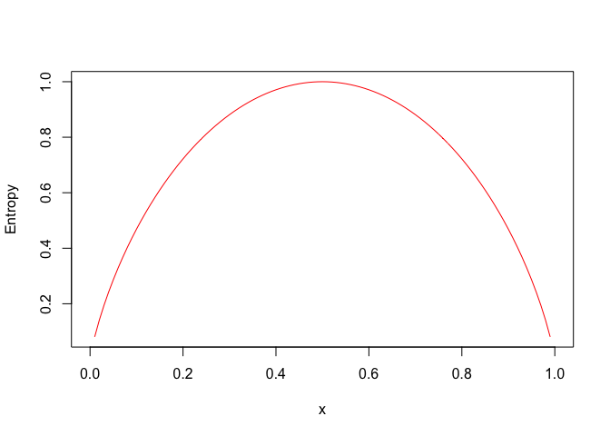

chapter_5\_decision_tree_classification
================
jason grahn
2023-12-07

We’re gunna make a few decision trees.

- C5.0, 1R, and RIPPER (huh?) ((that’s why I’m doing this!))

decision tree terms:

- **root node**: where the tree starts
- **decision node**: choices to be made based on attributes of the job
- **branch**: indicators of potential outcomes of a decision
- **leaf node / terminal node**: terminators that denote the action
  taken after the decision.

These work like flow-charts and should output a structure that humans
can consume. If someone hands you a decision tree model and doesn’t give
you the structure, they’re lying to you. Important for legal
transparency, or if the results might inform practices.

very widely used.

more terms:

- **recursive partitioning** (aka **divide and conquer**): a heuristic
  that splits data into subsets repeatedly until the algo decides
  homogeneity.

This would’ve been great to use on the renewals project. Probably
would’ve lifted it higher than I did and taken less time to do it.
Coulda used Frank’s dataset for price sensitivity.

“overly specific decisions do not always generalize more broadly.” -
Brett Lantz

- **axis-parallel splits**: each data split or decision considers one
  feature at a time. The split occurs parallel to one of the axis
  (visualize a scatterplot).

side-note, I should start playing with Quarto. I’ll start that in the
next chapter.

# C5.0

the industry standard for decision trees. Does well out-of-box. easy to
understand. easy to deploy.

## choosing a split

- **purity**: degree to which a subset of examples contains a single
  class
- **pure**: any subset of data composed of only a single class
- **entropy**: quantified randomness within a set of class values

A decision tree hopes to find splits that reduce entropy.

- **bits**: measurement of entropy. closer to 0 means closer to
  homogeneity, higher values indicate diversity.

an entropy curve:

``` r
curve(-x * log2(x) - (1 - x) * log2(1 - x), # the entropy algo for two class outcomes 
      col = "red", # just giving a spash of color
      xlab = "x", # titling an axis
      ylab = "Entropy", # titling an axis
      lwd = 1) # line width
```

<!-- -->

Note that as one class dominates the other, entropy scales to zero.

- **information gain**: when the algorithm calculates changes in
  homogeneity that results from splits on features. Or: “the reduction
  in entropy or surprise by transforming a dataset and is often used in
  training decision trees. Information gain is calculated by comparing
  the entropy of the dataset before and after a transformation” (per
  <https://machinelearningmastery.com/information-gain-and-mutual-information/>)
  ++ $InfoGain(F) = Entropy(S_1) - Entryopy(S_2)$ ++ The higher the
  information gain, the better a feature is at creating groups.

After a split, the data divides into multiple partitions, so $(S_2)$
must consider entropy across all partitions resulting from the split.

Trees can split on numeric variables too. Gotta test split results that
divide into groups though (binning that makes sense for the given
challenge) - effectively turning the numeric variables into categorical
data.

## Pruning

- **pruning**: reducing the size of the decision tree to better
  generalize unseen data.
- **early stopping**: stopping tree growth once it has reached a set
  number of decisions. AKA *pre-pruning*
- **post-pruning**: building a tree “too large” then cutting leaf nodes
  to reduce to more appropriate level. often more effective because it
  helps illustrate how large or deep the tree will go. ++C5.0 overfits,
  then prunes nodes and branches that have little effect or moves them.
- **subtree raising** or **subtree replacement**: the act of moving
  branches to earlier in the tree

## Example: finding risky bank loans

### data ingestion from online csv

``` r
credit <- 
    read.csv("https://raw.githubusercontent.com/PacktPublishing/Machine-Learning-with-R-Fourth-Edition/main/Chapter%2005/credit.csv",
             stringsAsFactors = TRUE)

credit |> str()
```

    ## 'data.frame':    1000 obs. of  17 variables:
    ##  $ checking_balance    : Factor w/ 4 levels "< 0 DM","> 200 DM",..: 1 3 4 1 1 4 4 3 4 3 ...
    ##  $ months_loan_duration: int  6 48 12 42 24 36 24 36 12 30 ...
    ##  $ credit_history      : Factor w/ 5 levels "critical","good",..: 1 2 1 2 4 2 2 2 2 1 ...
    ##  $ purpose             : Factor w/ 6 levels "business","car",..: 5 5 4 5 2 4 5 2 5 2 ...
    ##  $ amount              : int  1169 5951 2096 7882 4870 9055 2835 6948 3059 5234 ...
    ##  $ savings_balance     : Factor w/ 5 levels "< 100 DM","> 1000 DM",..: 5 1 1 1 1 5 4 1 2 1 ...
    ##  $ employment_duration : Factor w/ 5 levels "< 1 year","> 7 years",..: 2 3 4 4 3 3 2 3 4 5 ...
    ##  $ percent_of_income   : int  4 2 2 2 3 2 3 2 2 4 ...
    ##  $ years_at_residence  : int  4 2 3 4 4 4 4 2 4 2 ...
    ##  $ age                 : int  67 22 49 45 53 35 53 35 61 28 ...
    ##  $ other_credit        : Factor w/ 3 levels "bank","none",..: 2 2 2 2 2 2 2 2 2 2 ...
    ##  $ housing             : Factor w/ 3 levels "other","own",..: 2 2 2 1 1 1 2 3 2 2 ...
    ##  $ existing_loans_count: int  2 1 1 1 2 1 1 1 1 2 ...
    ##  $ job                 : Factor w/ 4 levels "management","skilled",..: 2 2 4 2 2 4 2 1 4 1 ...
    ##  $ dependents          : int  1 1 2 2 2 2 1 1 1 1 ...
    ##  $ phone               : Factor w/ 2 levels "no","yes": 2 1 1 1 1 2 1 2 1 1 ...
    ##  $ default             : Factor w/ 2 levels "no","yes": 1 2 1 1 2 1 1 1 1 2 ...

``` r
table(credit$checking_balance)
```

    ## 
    ##     < 0 DM   > 200 DM 1 - 200 DM    unknown 
    ##        274         63        269        394

``` r
table(credit$savings_balance)
```

    ## 
    ##      < 100 DM     > 1000 DM  100 - 500 DM 500 - 1000 DM       unknown 
    ##           603            48           103            63           183

These values use Deutschemark as the currency. Would probably be a good
idea to order those factors!

``` r
summary(credit$months_loan_duration)
```

    ##    Min. 1st Qu.  Median    Mean 3rd Qu.    Max. 
    ##     4.0    12.0    18.0    20.9    24.0    72.0

``` r
summary(credit$amount)
```

    ##    Min. 1st Qu.  Median    Mean 3rd Qu.    Max. 
    ##     250    1366    2320    3271    3972   18424

``` r
table(credit$default)
```

    ## 
    ##  no yes 
    ## 700 300

### data prep

creating random training & test data

using 90% for training, 10% for test because the small size of the data
(1000 observations) using the `random()` function. So we need to set a
seed value using `set.seed()`. The book provides a seed of **9829** so
we’ll use that too.

``` r
set.seed(9829) # setting the seed
train_sample <- sample(1000, 900) 
```

ah, this is interesting. They’re making a dataset of the rows we’re
going to use for the training set; then use *that* as the filter for the
credit data.

``` r
credit_train <- credit[train_sample,]
credit_test  <- credit[-train_sample,]
```

yep.

``` r
prop.table(table(credit_train$default))
```

    ## 
    ##        no       yes 
    ## 0.7055556 0.2944444

``` r
prop.table(table(credit_test$default))
```

    ## 
    ##   no  yes 
    ## 0.65 0.35

### training

``` r
library(C50)
```

We’ll build a model to predict the `default` variable using *formula
syntax*, then use the model to predict.

``` r
credit_model <- C5.0(default ~ ., # use all variables ...
                     data = credit_train) # ...of the credit_train data 

credit_model
```

    ## 
    ## Call:
    ## C5.0.formula(formula = default ~ ., data = credit_train)
    ## 
    ## Classification Tree
    ## Number of samples: 900 
    ## Number of predictors: 16 
    ## 
    ## Tree size: 67 
    ## 
    ## Non-standard options: attempt to group attributes

We used 16 predictors to determine default, and the tree is 67 decisions
deep.

I bet there’s a different package out there that develops better
visualizations for this.

``` r
summary(credit_model) 
```

    ## 
    ## Call:
    ## C5.0.formula(formula = default ~ ., data = credit_train)
    ## 
    ## 
    ## C5.0 [Release 2.07 GPL Edition]      Sat Dec 16 17:04:22 2023
    ## -------------------------------
    ## 
    ## Class specified by attribute `outcome'
    ## 
    ## Read 900 cases (17 attributes) from undefined.data
    ## 
    ## Decision tree:
    ## 
    ## checking_balance in {> 200 DM,unknown}: no (415/55)
    ## checking_balance in {< 0 DM,1 - 200 DM}:
    ## :...credit_history in {perfect,very good}: yes (59/16)
    ##     credit_history in {critical,good,poor}:
    ##     :...months_loan_duration > 27:
    ##         :...dependents > 1:
    ##         :   :...age <= 45: no (12/2)
    ##         :   :   age > 45: yes (2)
    ##         :   dependents <= 1:
    ##         :   :...savings_balance = > 1000 DM: no (2/1)
    ##         :       savings_balance = 500 - 1000 DM: yes (1)
    ##         :       savings_balance = 100 - 500 DM:
    ##         :       :...credit_history = critical: no (1)
    ##         :       :   credit_history = good: yes (7)
    ##         :       :   credit_history = poor:
    ##         :       :   :...existing_loans_count <= 1: no (3)
    ##         :       :       existing_loans_count > 1: yes (3/1)
    ##         :       savings_balance = unknown:
    ##         :       :...checking_balance = 1 - 200 DM: no (8/1)
    ##         :       :   checking_balance = < 0 DM:
    ##         :       :   :...credit_history = critical: no (1)
    ##         :       :       credit_history in {good,poor}: yes (4)
    ##         :       savings_balance = < 100 DM:
    ##         :       :...job in {skilled,unskilled}: yes (43/9)
    ##         :           job = unemployed: no (1)
    ##         :           job = management:
    ##         :           :...existing_loans_count > 1: yes (4)
    ##         :               existing_loans_count <= 1:
    ##         :               :...amount <= 7582: no (5)
    ##         :                   amount > 7582:
    ##         :                   :...purpose in {business,car,education,
    ##         :                       :           furniture/appliances,
    ##         :                       :           renovations}: yes (4)
    ##         :                       purpose = car0: no (1)
    ##         months_loan_duration <= 27:
    ##         :...months_loan_duration <= 11:
    ##             :...job in {management,unemployed}:
    ##             :   :...percent_of_income <= 1: yes (3)
    ##             :   :   percent_of_income > 1:
    ##             :   :   :...age <= 34: yes (2)
    ##             :   :       age > 34: no (7/1)
    ##             :   job in {skilled,unskilled}:
    ##             :   :...age > 24: no (52/2)
    ##             :       age <= 24:
    ##             :       :...years_at_residence <= 1: no (3)
    ##             :           years_at_residence > 1:
    ##             :           :...job = skilled: yes (4)
    ##             :               job = unskilled: no (1)
    ##             months_loan_duration > 11:
    ##             :...credit_history = poor:
    ##                 :...housing = other: yes (2)
    ##                 :   housing in {own,rent}: no (20/4)
    ##                 credit_history = critical:
    ##                 :...purpose in {business,education}: no (10/1)
    ##                 :   purpose in {car0,renovations}: yes (2)
    ##                 :   purpose = car:
    ##                 :   :...other_credit in {none,store}: no (18/3)
    ##                 :   :   other_credit = bank:
    ##                 :   :   :...job in {management,skilled,unemployed}: yes (5)
    ##                 :   :       job = unskilled: no (2)
    ##                 :   purpose = furniture/appliances:
    ##                 :   :...phone = yes: no (11)
    ##                 :       phone = no:
    ##                 :       :...savings_balance in {> 1000 DM,
    ##                 :           :                   unknown}: no (0)
    ##                 :           savings_balance in {100 - 500 DM,
    ##                 :           :                   500 - 1000 DM}: yes (2)
    ##                 :           savings_balance = < 100 DM:
    ##                 :           :...age <= 29: no (8)
    ##                 :               age > 29: yes (4/1)
    ##                 credit_history = good:
    ##                 :...purpose in {car0,renovations}: no (7/2)
    ##                     purpose = business:
    ##                     :...dependents <= 1: no (8/1)
    ##                     :   dependents > 1: yes (3/1)
    ##                     purpose = education:
    ##                     :...savings_balance = < 100 DM: yes (3)
    ##                     :   savings_balance in {> 1000 DM,100 - 500 DM,
    ##                     :                       500 - 1000 DM,unknown}: no (3)
    ##                     purpose = car:
    ##                     :...amount <= 1391:
    ##                     :   :...savings_balance in {< 100 DM,100 - 500 DM,
    ##                     :   :   :                   500 - 1000 DM,
    ##                     :   :   :                   unknown}: yes (20/2)
    ##                     :   :   savings_balance = > 1000 DM: no (2)
    ##                     :   amount > 1391:
    ##                     :   :...amount <= 9629: no (30/8)
    ##                     :       amount > 9629: yes (3)
    ##                     purpose = furniture/appliances:
    ##                     :...savings_balance in {> 1000 DM,
    ##                         :                   500 - 1000 DM}: no (7/1)
    ##                         savings_balance = 100 - 500 DM:
    ##                         :...checking_balance = < 0 DM: yes (4)
    ##                         :   checking_balance = 1 - 200 DM:
    ##                         :   :...age <= 28: yes (2)
    ##                         :       age > 28: no (2)
    ##                         savings_balance = unknown:
    ##                         :...job = management: yes (1)
    ##                         :   job in {unemployed,unskilled}: no (3)
    ##                         :   job = skilled:
    ##                         :   :...age <= 28: yes (6/1)
    ##                         :       age > 28: no (4)
    ##                         savings_balance = < 100 DM:
    ##                         :...employment_duration = 4 - 7 years: no (5)
    ##                             employment_duration = > 7 years:
    ##                             :...job = management: yes (2)
    ##                             :   job in {skilled,unemployed,
    ##                             :           unskilled}: no (7/1)
    ##                             employment_duration = unemployed:
    ##                             :...housing = other: no (1)
    ##                             :   housing in {own,rent}: yes (3)
    ##                             employment_duration = < 1 year:
    ##                             :...checking_balance = < 0 DM: no (9/1)
    ##                             :   checking_balance = 1 - 200 DM:
    ##                             :   :...job in {management,skilled,
    ##                             :       :       unemployed}: yes (3)
    ##                             :       job = unskilled: no (1)
    ##                             employment_duration = 1 - 4 years:
    ##                             :...months_loan_duration <= 15: no (13/2)
    ##                                 months_loan_duration > 15:
    ##                                 :...checking_balance = 1 - 200 DM: no (2)
    ##                                     checking_balance = < 0 DM:
    ##                                     :...months_loan_duration <= 22: yes (8)
    ##                                         months_loan_duration > 22: no (6/1)
    ## 
    ## 
    ## Evaluation on training data (900 cases):
    ## 
    ##      Decision Tree   
    ##    ----------------  
    ##    Size      Errors  
    ## 
    ##      66  118(13.1%)   <<
    ## 
    ## 
    ##     (a)   (b)    <-classified as
    ##    ----  ----
    ##     604    31    (a): class no
    ##      87   178    (b): class yes
    ## 
    ## 
    ##  Attribute usage:
    ## 
    ##  100.00% checking_balance
    ##   53.89% credit_history
    ##   47.33% months_loan_duration
    ##   26.11% purpose
    ##   24.33% savings_balance
    ##   18.22% job
    ##   12.56% dependents
    ##   12.11% age
    ##    7.22% amount
    ##    6.67% employment_duration
    ##    2.89% housing
    ##    2.78% other_credit
    ##    2.78% phone
    ##    2.22% existing_loans_count
    ##    1.33% percent_of_income
    ##    0.89% years_at_residence
    ## 
    ## 
    ## Time: 0.0 secs

Now we predict.

``` r
credit_pred <- predict(credit_model, 
                       credit_test)

gmodels::CrossTable(credit_test$default,
                    credit_pred,
                    prop.chisq = FALSE,
                    prop.c = FALSE,
                    prop.r = FALSE,
                    dnn = c('actual default', 'predicted default'))
```

    ## 
    ##  
    ##    Cell Contents
    ## |-------------------------|
    ## |                       N |
    ## |         N / Table Total |
    ## |-------------------------|
    ## 
    ##  
    ## Total Observations in Table:  100 
    ## 
    ##  
    ##                | predicted default 
    ## actual default |        no |       yes | Row Total | 
    ## ---------------|-----------|-----------|-----------|
    ##             no |        56 |         9 |        65 | 
    ##                |     0.560 |     0.090 |           | 
    ## ---------------|-----------|-----------|-----------|
    ##            yes |        24 |        11 |        35 | 
    ##                |     0.240 |     0.110 |           | 
    ## ---------------|-----------|-----------|-----------|
    ##   Column Total |        80 |        20 |       100 | 
    ## ---------------|-----------|-----------|-----------|
    ## 
    ## 

24% predicted `not default` when in actuality, yes, they defaulted.
That’s not great and needs to be improved.

### improving results

We’re gunna use *boosting* to improve the model. Boosting seems to do a
bit of component combination.

``` r
credit_boost10 <- C5.0(default ~ ., # use all variables ...
                       data = credit_train, # ...of the credit_train data 
                       trials = 10) # defacto standard for trials.

credit_boost10
```

    ## 
    ## Call:
    ## C5.0.formula(formula = default ~ ., data = credit_train, trials = 10)
    ## 
    ## Classification Tree
    ## Number of samples: 900 
    ## Number of predictors: 16 
    ## 
    ## Number of boosting iterations: 10 
    ## Average tree size: 57.3 
    ## 
    ## Non-standard options: attempt to group attributes

``` r
# summary(credit_boost10)
credit_boost_pred10 <- predict(credit_boost10, 
                               credit_test)

gmodels::CrossTable(credit_test$default, 
                    credit_boost_pred10,
                    prop.chisq = FALSE, 
                    prop.c = FALSE, 
                    prop.r = FALSE,
                    dnn = c('actual default', 'predicted default'))
```

    ## 
    ##  
    ##    Cell Contents
    ## |-------------------------|
    ## |                       N |
    ## |         N / Table Total |
    ## |-------------------------|
    ## 
    ##  
    ## Total Observations in Table:  100 
    ## 
    ##  
    ##                | predicted default 
    ## actual default |        no |       yes | Row Total | 
    ## ---------------|-----------|-----------|-----------|
    ##             no |        58 |         7 |        65 | 
    ##                |     0.580 |     0.070 |           | 
    ## ---------------|-----------|-----------|-----------|
    ##            yes |        19 |        16 |        35 | 
    ##                |     0.190 |     0.160 |           | 
    ## ---------------|-----------|-----------|-----------|
    ##   Column Total |        77 |        23 |       100 | 
    ## ---------------|-----------|-----------|-----------|
    ## 
    ## 

#### cost matrix

We build a cost matrix in order to penalize the decision tree for
errors, preventing mistakes.

``` r
matrix_dimensions <- list(c("no", "yes"), 
                          c("no", "yes"))

names(matrix_dimensions) <- c("predicted", "actual")

matrix_dimensions
```

    ## $predicted
    ## [1] "no"  "yes"
    ## 
    ## $actual
    ## [1] "no"  "yes"

Matrix built, now the costs of each. R goes top to bottom.

``` r
error_cost <- matrix(c(0,1,4,0),
                     nrow = 2,
                     dimnames = matrix_dimensions)

error_cost
```

    ##          actual
    ## predicted no yes
    ##       no   0   4
    ##       yes  1   0

No penalties for guessing correctly, but a penalty of 1 for predicting
*Yes* when the default is *no*; and a penality of 4 when the prediction
is *No* when the actual is *yes*.

``` r
credit_cost <- C5.0(default ~ .,
                    data = credit_train,
                    costs = error_cost)

credit_cost_pred <- predict(credit_cost, credit_test)

gmodels::CrossTable(credit_test$default,
                    credit_cost_pred,
                    prop.chisq = FALSE, 
                    prop.c = FALSE, 
                    prop.r = FALSE,
                    dnn = c('actual default', 'predicted default'))
```

    ## 
    ##  
    ##    Cell Contents
    ## |-------------------------|
    ## |                       N |
    ## |         N / Table Total |
    ## |-------------------------|
    ## 
    ##  
    ## Total Observations in Table:  100 
    ## 
    ##  
    ##                | predicted default 
    ## actual default |        no |       yes | Row Total | 
    ## ---------------|-----------|-----------|-----------|
    ##             no |        34 |        31 |        65 | 
    ##                |     0.340 |     0.310 |           | 
    ## ---------------|-----------|-----------|-----------|
    ##            yes |         5 |        30 |        35 | 
    ##                |     0.050 |     0.300 |           | 
    ## ---------------|-----------|-----------|-----------|
    ##   Column Total |        39 |        61 |       100 | 
    ## ---------------|-----------|-----------|-----------|
    ## 
    ## 

# Rule Learners

(Different than decision tree learners)

Rule learning classifiers **separate and conquer** - training in
partitions through the dataset. Also known as **covering algorithms**.

- **ZeroR**: considers no features and learns no `R`ules (= zero R-ules,
  get it?). It only predicts the most common class.
- **1R**: selects *one* rule to classify. ++ for *each feature* 1R
  divides the data into groups with similar values. Then chooses the
  single rule that misclassfies least.
- **IREP**: Incremental Reduced Error Pruning pre- and post-prunes to
  grow complex rules and prunes before separating the data.
- **RIPPER**: Repeated Incremental Pruning to Produce Error Reduction.
  Produces parsimonious (stingy / frugal) models compared to decision
  trees. Considers many features, including compound rules (If X and Y
  then …). Works in three phases: ++ Grow - add conditions greedily,
  seemingly overfits. ++ Prune - zero entropy rules get pruned, then
  grow/prune is repeated until a stopping criteria is met. ++ Optimize -
  after stopping, it’s gone back through to optimize.
- **greedy learners**: decisions trees and rule learners that use data
  first-come, first-serve. Markes & solves one partition before moving
  onto the next. Doesn’t produce optimal results. ++ Once a feature is
  split in *Divide and Conquer*, partitions created by the split aren’t
  re-evaluated, only further subdivided. Our future is limited by our
  past decisions. ++ *Separate and Conquer* does allow for examples not
  covered by prior rules to be re-evaluated.

decision trees often result with more complex rules than a rule learner,
though sometimes more computationally easy.

## Identifying poisonous mushrooms!

Let’s go get data from the github.

``` r
mushrooms <- 
    read.csv("https://raw.githubusercontent.com/PacktPublishing/Machine-Learning-with-R-Fourth-Edition/main/Chapter%2005/mushrooms.csv",
             stringsAsFactors = TRUE)

mushrooms |> str()
```

    ## 'data.frame':    8124 obs. of  23 variables:
    ##  $ type                    : Factor w/ 2 levels "edible","poisonous": 2 1 1 2 1 1 1 1 2 1 ...
    ##  $ cap_shape               : Factor w/ 6 levels "bell","conical",..: 3 3 1 3 3 3 1 1 3 1 ...
    ##  $ cap_surface             : Factor w/ 4 levels "fibrous","grooves",..: 4 4 4 3 4 3 4 3 3 4 ...
    ##  $ cap_color               : Factor w/ 10 levels "brown","buff",..: 1 10 9 9 4 10 9 9 9 10 ...
    ##  $ bruises                 : Factor w/ 2 levels "no","yes": 2 2 2 2 1 2 2 2 2 2 ...
    ##  $ odor                    : Factor w/ 9 levels "almond","anise",..: 8 1 2 8 7 1 1 2 8 1 ...
    ##  $ gill_attachment         : Factor w/ 2 levels "attached","free": 2 2 2 2 2 2 2 2 2 2 ...
    ##  $ gill_spacing            : Factor w/ 2 levels "close","crowded": 1 1 1 1 2 1 1 1 1 1 ...
    ##  $ gill_size               : Factor w/ 2 levels "broad","narrow": 2 1 1 2 1 1 1 1 2 1 ...
    ##  $ gill_color              : Factor w/ 12 levels "black","brown",..: 1 1 2 2 1 2 5 2 8 5 ...
    ##  $ stalk_shape             : Factor w/ 2 levels "enlarging","tapering": 1 1 1 1 2 1 1 1 1 1 ...
    ##  $ stalk_root              : Factor w/ 5 levels "bulbous","club",..: 3 2 2 3 3 2 2 2 3 2 ...
    ##  $ stalk_surface_above_ring: Factor w/ 4 levels "fibrous","scaly",..: 4 4 4 4 4 4 4 4 4 4 ...
    ##  $ stalk_surface_below_ring: Factor w/ 4 levels "fibrous","scaly",..: 4 4 4 4 4 4 4 4 4 4 ...
    ##  $ stalk_color_above_ring  : Factor w/ 9 levels "brown","buff",..: 8 8 8 8 8 8 8 8 8 8 ...
    ##  $ stalk_color_below_ring  : Factor w/ 9 levels "brown","buff",..: 8 8 8 8 8 8 8 8 8 8 ...
    ##  $ veil_type               : Factor w/ 1 level "partial": 1 1 1 1 1 1 1 1 1 1 ...
    ##  $ veil_color              : Factor w/ 4 levels "brown","orange",..: 3 3 3 3 3 3 3 3 3 3 ...
    ##  $ ring_number             : Factor w/ 3 levels "none","one","two": 2 2 2 2 2 2 2 2 2 2 ...
    ##  $ ring_type               : Factor w/ 5 levels "evanescent","flaring",..: 5 5 5 5 1 5 5 5 5 5 ...
    ##  $ spore_print_color       : Factor w/ 9 levels "black","brown",..: 1 2 2 1 2 1 1 2 1 1 ...
    ##  $ population              : Factor w/ 6 levels "abundant","clustered",..: 4 3 3 4 1 3 3 4 5 4 ...
    ##  $ habitat                 : Factor w/ 7 levels "grasses","leaves",..: 5 1 3 5 1 1 3 3 1 3 ...

look at all those factors!! Also, `veil_type` looks homogeneous already.
huh.

``` r
# book wants to drop it. 
# Tidy would just use `select()` to remove it, but we can do it base R too..

mushrooms$veil_type <- NULL
```

``` r
table(mushrooms$type)
```

    ## 
    ##    edible poisonous 
    ##      4208      3916

the goal is to predict poisonous. And we’re going to install the `OneR`
package to do it.

``` r
library(OneR)
```

``` r
mushroom_1r <- OneR(type ~ .,
                    data = mushrooms)

mushroom_1r
```

    ## 
    ## Call:
    ## OneR.formula(formula = type ~ ., data = mushrooms)
    ## 
    ## Rules:
    ## If odor = almond   then type = edible
    ## If odor = anise    then type = edible
    ## If odor = creosote then type = poisonous
    ## If odor = fishy    then type = poisonous
    ## If odor = foul     then type = poisonous
    ## If odor = musty    then type = poisonous
    ## If odor = none     then type = edible
    ## If odor = pungent  then type = poisonous
    ## If odor = spicy    then type = poisonous
    ## 
    ## Accuracy:
    ## 8004 of 8124 instances classified correctly (98.52%)

``` r
mushroom_1r_pred <- predict(mushroom_1r, mushrooms)

table(actual = mushrooms$type,
      predicted = mushroom_1r_pred)
```

    ##            predicted
    ## actual      edible poisonous
    ##   edible      4208         0
    ##   poisonous    120      3796

and now we’ll flip to JRip to improve on that..JRip comes from the RWeka
package.

Oh boy this is a ball of twine..

“No Java runtime present, requesting install. \*\*\* Java interpreter
doesn’t work properly.”

Oh, per
[here](https://stackoverflow.com/questions/44009058/even-though-jre-8-is-installed-on-my-mac-no-java-runtime-present-requesting-t)
it’s because I need to install
<https://www.oracle.com/java/technologies/downloads/#jdk21-mac>

(Yep, that fixed it).

``` r
library(RWeka)
```

    ## 
    ## Attaching package: 'RWeka'

    ## The following object is masked from 'package:OneR':
    ## 
    ##     OneR

``` r
mushroom_jrip <- JRip(type ~ ., 
                      data = mushrooms)

mushroom_jrip
```

    ## JRIP rules:
    ## ===========
    ## 
    ## (odor = foul) => type=poisonous (2160.0/0.0)
    ## (gill_size = narrow) and (gill_color = buff) => type=poisonous (1152.0/0.0)
    ## (gill_size = narrow) and (odor = pungent) => type=poisonous (256.0/0.0)
    ## (odor = creosote) => type=poisonous (192.0/0.0)
    ## (spore_print_color = green) => type=poisonous (72.0/0.0)
    ## (stalk_surface_below_ring = scaly) and (stalk_surface_above_ring = silky) => type=poisonous (68.0/0.0)
    ## (habitat = leaves) and (cap_color = white) => type=poisonous (8.0/0.0)
    ## (stalk_color_above_ring = yellow) => type=poisonous (8.0/0.0)
    ##  => type=edible (4208.0/0.0)
    ## 
    ## Number of Rules : 9

This shows more complex, but also simple rules to follow.

``` r
summary(mushroom_jrip)
```

    ## 
    ## === Summary ===
    ## 
    ## Correctly Classified Instances        8124              100      %
    ## Incorrectly Classified Instances         0                0      %
    ## Kappa statistic                          1     
    ## Mean absolute error                      0     
    ## Root mean squared error                  0     
    ## Relative absolute error                  0      %
    ## Root relative squared error              0      %
    ## Total Number of Instances             8124     
    ## 
    ## === Confusion Matrix ===
    ## 
    ##     a    b   <-- classified as
    ##  4208    0 |    a = edible
    ##     0 3916 |    b = poisonous

``` r
# Rule Learner Using C5.0 Decision Trees (not in text)
#library(C50)
mushroom_c5rules <- C5.0(type ~ ., 
                         data = mushrooms, 
                         rules = TRUE)
summary(mushroom_c5rules)
```

    ## 
    ## Call:
    ## C5.0.formula(formula = type ~ ., data = mushrooms, rules = TRUE)
    ## 
    ## 
    ## C5.0 [Release 2.07 GPL Edition]      Sat Dec 16 17:04:26 2023
    ## -------------------------------
    ## 
    ## Class specified by attribute `outcome'
    ## 
    ## Read 8124 cases (22 attributes) from undefined.data
    ## 
    ## Rules:
    ## 
    ## Rule 1: (4148/4, lift 1.9)
    ##  cap_surface in {fibrous, scaly, smooth}
    ##  odor in {almond, anise, none}
    ##  stalk_color_below_ring in {gray, orange, pink, red, white}
    ##  spore_print_color in {black, brown, buff, chocolate, orange, purple,
    ##                               white, yellow}
    ##  ->  class edible  [0.999]
    ## 
    ## Rule 2: (3500/12, lift 1.9)
    ##  cap_surface in {fibrous, scaly, smooth}
    ##  odor in {almond, anise, none}
    ##  stalk_root in {bulbous, club, equal, rooted}
    ##  spore_print_color in {black, brown, purple, white}
    ##  ->  class edible  [0.996]
    ## 
    ## Rule 3: (3796, lift 2.1)
    ##  odor in {creosote, fishy, foul, musty, pungent, spicy}
    ##  ->  class poisonous  [1.000]
    ## 
    ## Rule 4: (72, lift 2.0)
    ##  spore_print_color = green
    ##  ->  class poisonous  [0.986]
    ## 
    ## Rule 5: (24, lift 2.0)
    ##  stalk_color_below_ring = yellow
    ##  ->  class poisonous  [0.962]
    ## 
    ## Rule 6: (16, lift 2.0)
    ##  stalk_root = missing
    ##  stalk_color_below_ring = brown
    ##  ->  class poisonous  [0.944]
    ## 
    ## Rule 7: (4, lift 1.7)
    ##  cap_surface = grooves
    ##  ->  class poisonous  [0.833]
    ## 
    ## Default class: edible
    ## 
    ## 
    ## Evaluation on training data (8124 cases):
    ## 
    ##          Rules     
    ##    ----------------
    ##      No      Errors
    ## 
    ##       7   12( 0.1%)   <<
    ## 
    ## 
    ##     (a)   (b)    <-classified as
    ##    ----  ----
    ##    4208          (a): class edible
    ##      12  3904    (b): class poisonous
    ## 
    ## 
    ##  Attribute usage:
    ## 
    ##   98.67% odor
    ##   52.83% spore_print_color
    ##   51.99% cap_surface
    ##   51.55% stalk_color_below_ring
    ##   43.28% stalk_root
    ## 
    ## 
    ## Time: 0.0 secs
