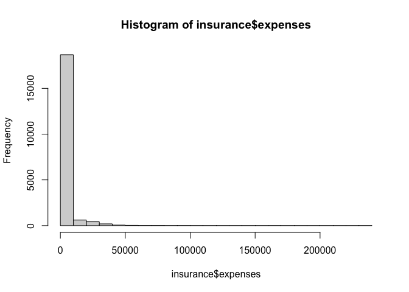
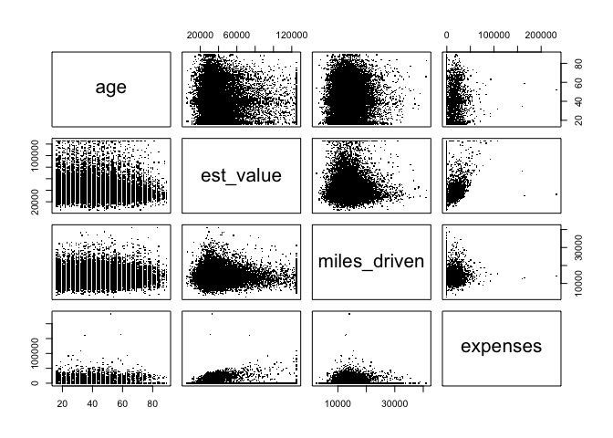
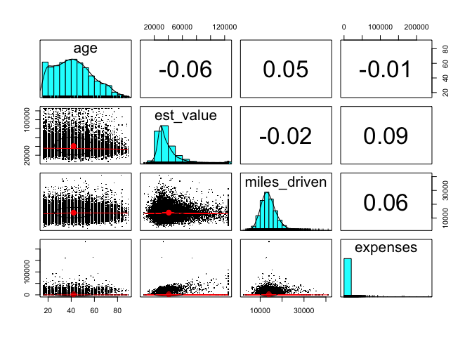
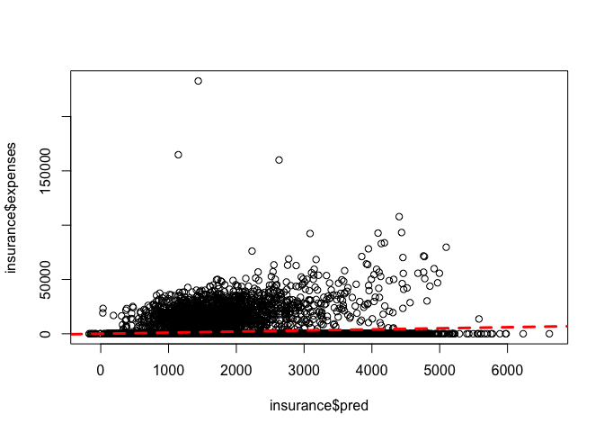
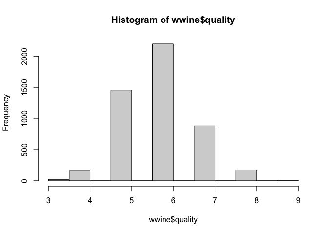
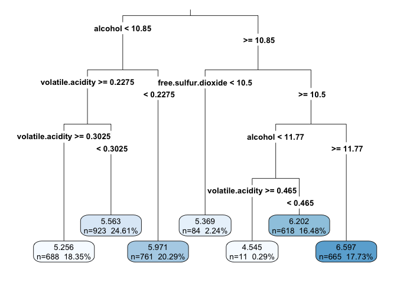

# chapter 6, Forecasting numeric data with regression
jason grahn

## Chapter 6 - forecasting

# Regression

- **dependent variable**: value to predict

- **independent variable**: predictors

- **slope-intercept form**: the old $y = m(x) + B$ or in generic form:
  $y = a + b(x)$

  - Slope is the `m` (or `b`) in those formulas.

  - `B` or `a` is the y-intercept. If no value is supplied, it’s `0`.

Different types of regression:

- linear: straight lines! — assuming the dependent variable is measured
  on a continuous scale

  - simple linear: using a single independent variable

  - multiple linear (aka “multiple): using 2+ independent variables
    (instantly more complex)

- logistic: modeling binary outcomes (Yes / No, True / False, etc)

- poisson: predicts a count events that occur

- gamma: used for right-skewed data (like poisson) - models the *time*
  to an event or *cost* of an event (insurance claim costs for an
  accident, for example)

All of these are GLMs (generalized linear models)

## Ordinary Least Squares estimation

- Ordinary Least Squares: method to determine the optimal estimates of
  `a` and `b` in the generic linear regression formulas.

- Sum of Squared Errors (SSE) (aka: residuals): vertical distance
  between predicted `y` values and their actual `y` values. These can be
  above or below the linear plotting. Squaring this distance makes the
  values positive.

  - The total sum of $(y_i - \hat{y}_i)^2$ = the sum of errors squared
    or $e^2_i$

  - the “hat” over the Y generally means “an estimate of this value”

Lets go get some data.

``` r
launch <- 
    read.csv("https://raw.githubusercontent.com/PacktPublishing/Machine-Learning-with-R-Fourth-Edition/main/Chapter%2006/challenger.csv")

launch |> str()
```

    'data.frame':   23 obs. of  4 variables:
     $ distress_ct         : int  0 1 0 0 0 0 0 0 1 1 ...
     $ temperature         : int  66 70 69 68 67 72 73 70 57 63 ...
     $ field_check_pressure: int  50 50 50 50 50 50 100 100 200 200 ...
     $ flight_num          : int  1 2 3 4 5 6 7 8 9 10 ...

``` r
b <- 
    cov(launch$temperature, 
        launch$distress_ct) / 
    var(launch$temperature)
b
```

    [1] -0.04753968

``` r
a <- mean(launch$distress_ct) - b * mean(launch$temperature)

a
```

    [1] 3.698413

## Correlations

- correlation: how closely a relationship follows a straight line.

  - **pearson’s correlation coefficient (R):** a numeric value of
    correlation, in a range of -1 to +1 where the min and max values
    reflect “perfect” relationships. A value of 0 is “no relationship”

  - For data data around humans. +/-0.5 *can* be considered strong.

  - for mechanical / machine processes, +/-0.5 *can* be considered
    pretty weak.

``` r
cor(launch$temperature, launch$distress_ct)
```

    [1] -0.5111264

## Multiple linear regression

writing a basic regression function…

``` r
reg <- 
    function(y , x) {
        x <- as.matrix(x) # take a set of values and make a matrix
        x <- cbind(Intercept = 1, x) # create a new column and set values to `1`
        b <- solve(t(x) %*% x) %*% t(x) %*% y 
        # %*% = multiples two matricies
        # t transposes a matrix
        # solve takes the inverse
        colnames(b) <- "estimate"
        print(b)
    }
```

``` r
str(launch)
```

    'data.frame':   23 obs. of  4 variables:
     $ distress_ct         : int  0 1 0 0 0 0 0 0 1 1 ...
     $ temperature         : int  66 70 69 68 67 72 73 70 57 63 ...
     $ field_check_pressure: int  50 50 50 50 50 50 100 100 200 200 ...
     $ flight_num          : int  1 2 3 4 5 6 7 8 9 10 ...

``` r
reg(y = launch$distress_ct,
    x = launch[2])
```

                   estimate
    Intercept    3.69841270
    temperature -0.04753968

interesting - if we specifically call the column name the name doesn’t
reflect in the estimate table. Only by using the `[]` notation does it
carry over. hm.

``` r
reg(y = launch$distress_ct,
    x = launch[2:4])
```

                             estimate
    Intercept             3.527093383
    temperature          -0.051385940
    field_check_pressure  0.001757009
    flight_num            0.014292843

R has built in linear modeling and I dont know why this author *chose*
to write his own function instead of teaching that…

``` r
# model1 <- 
#     lm(distress_ct ~ temperature + field_check_pressure + flight_num, 
#        data = launch)

model2 <- 
    lm(distress_ct ~ ., 
       data = launch)

# model1
model2
```


    Call:
    lm(formula = distress_ct ~ ., data = launch)

    Coefficients:
             (Intercept)           temperature  field_check_pressure  
                3.527093             -0.051386              0.001757  
              flight_num  
                0.014293  

## GLM and logistic regression

GLM = Generalized linear models

“For modeling counting values, for categorical or binary outcomes, as
well as other cases where the target is not a normally distributed
continuous variable, standard linear regression is not the best tool for
the job.”

GLM “loosens” assumptions of linear modeling:

- Allows the target (dependent variable) to be non-normally distributed,
  non-continuous.

- Allows the the variance of the target to be related to it’s mean.

**Logistic regression:** GLM variant that uses binomial distribution
with a log link function. The most important form allows regression to
be used on binary classifiers.

- **logit link:** function in the form of $log(p / (1-p))$ where `p` is
  a probability.

  - $(p / (1-p)$ expresses the probability as odds. “The probability it
    happens divided by the probability it doesn’t.

- **odds ratios:** logistic regression coefficients indicate the
  difference in the odds of `y` due to a one-unit increase in `x`. When
  odds are exponentiated, odds ratios express the relative increase or
  decrease in the chances that `y` happens.

The relationship between odds and probability isn’t linear. Impact of a
change on a failure probability depends on the context in which the
change is happening.

Fitted regression models create an s-like curve. Represents a
probability estimate on a continuous scale between 0 (no chance) and 1
(gunna happen!)

To get a binary prediction (TRUE/FALSE), define the probability
threshold. ex: if probability to renew is greater than .7, then “TRUE”
else “FALSE”. The higher the threshold, the harder to achieve (obvi).

- **maximum likelihood estimation (MLE):** GLM technique which finds the
  parameter values for the distribution that are most likely to have
  generated the observed data.

# Ex: Predicting claims cost using LR.

## Getting data

let’s go get data:

``` r
insurance <- 
    read.csv("https://raw.githubusercontent.com/PacktPublishing/Machine-Learning-with-R-Fourth-Edition/main/Chapter%2006/autoinsurance.csv",
             stringsAsFactors = TRUE)

insurance |> str()
```

    'data.frame':   20000 obs. of  11 variables:
     $ age                : int  19 30 39 64 33 27 62 39 67 38 ...
     $ geo_area           : Factor w/ 3 levels "rural","suburban",..: 3 3 3 2 2 2 2 3 1 3 ...
     $ vehicle_type       : Factor w/ 4 levels "car","minivan",..: 3 3 1 3 3 3 1 4 1 1 ...
     $ est_value          : int  28811 52603 113870 35228 19190 22899 42172 29468 56469 103371 ...
     $ miles_driven       : int  11700 12811 9784 17400 14665 12570 15539 10763 13811 11805 ...
     $ college_grad_ind   : int  0 1 1 0 0 1 1 0 1 1 ...
     $ speeding_ticket_ind: int  1 0 0 0 0 0 0 0 0 0 ...
     $ hard_braking_ind   : int  1 0 0 0 0 0 0 0 0 0 ...
     $ late_driving_ind   : int  0 0 0 0 0 0 0 0 0 0 ...
     $ clean_driving_ind  : int  0 1 0 1 1 0 1 1 0 1 ...
     $ expenses           : num  0 6311 49684 0 0 ...

of note are the binary fields `hard_braking_ind` and `late_driving_ind`
that reflect bad driving behaviours.

## exploring

The dependent variable - what we’re predicting - is “expenses”.

Checking for nomality..

``` r
summary(insurance$expenses)
```

       Min. 1st Qu.  Median    Mean 3rd Qu.    Max. 
          0       0       0    1709       0  232797 

definitely not normal. string right skew.

``` r
hist(insurance$expenses,
     breaks = 30)
```



``` r
table(insurance$geo_area)
```


       rural suburban    urban 
        3622     8727     7651 

``` r
table(insurance$vehicle_type)
```


        car minivan     suv   truck 
       5801     726    9838    3635 

## data relationships - the correlation matrix

We use these to see if anything has a high relationship with the
dependent variable *or* any other variable

``` r
cor(insurance[c("age", "est_value", "miles_driven", "expenses")]) |> 
    round(4)
```

                     age est_value miles_driven expenses
    age           1.0000   -0.0599       0.0481  -0.0091
    est_value    -0.0599    1.0000      -0.0180   0.0881
    miles_driven  0.0481   -0.0180       1.0000   0.0621
    expenses     -0.0091    0.0881       0.0621   1.0000

## visualizing relationships with scatterplots

- **SPLOM:** scatterplot matrix. a collection of scatterplots in a grid.

``` r
pairs(insurance[c("age", "est_value", "miles_driven",
                  "expenses")], 
      pch = ".")
```



Better plotting of the same through `psych`.

``` r
psych::pairs.panels(insurance[c("age", "est_value", "miles_driven",
                           "expenses")], 
                     pch = ".")
```



## training the model

``` r
ins_model <- 
    lm(expenses ~ ., 
       data = insurance)

options(scipen = 999)
ins_model
```


    Call:
    lm(formula = expenses ~ ., data = insurance)

    Coefficients:
            (Intercept)                  age     geo_areasuburban  
            -1154.91486             -1.88603            191.07895  
          geo_areaurban  vehicle_typeminivan      vehicle_typesuv  
              169.11426            115.27862            -19.69500  
      vehicle_typetruck            est_value         miles_driven  
               21.56836              0.03115              0.11899  
       college_grad_ind  speeding_ticket_ind     hard_braking_ind  
              -25.04030            155.82410             11.84522  
       late_driving_ind    clean_driving_ind  
              362.48550           -239.04740  

Note the factor variables are blown up into individual categories for
each level of the factor *minus one.* The missing factor is used as
reference point to which the others are compared.

## evaluating model performance

``` r
summary(ins_model)
```


    Call:
    lm(formula = expenses ~ ., data = insurance)

    Residuals:
       Min     1Q Median     3Q    Max 
     -6707  -1989  -1492  -1057 231252 

    Coefficients:
                            Estimate   Std. Error t value             Pr(>|t|)    
    (Intercept)         -1154.914856   351.370732  -3.287              0.00101 ** 
    age                    -1.886027     3.144556  -0.600              0.54866    
    geo_areasuburban      191.078953   143.199245   1.334              0.18210    
    geo_areaurban         169.114255   157.850516   1.071              0.28402    
    vehicle_typeminivan   115.278619   276.579845   0.417              0.67683    
    vehicle_typesuv       -19.695001   117.990151  -0.167              0.86743    
    vehicle_typetruck      21.568360   153.630939   0.140              0.88835    
    est_value               0.031145     0.002497  12.475 < 0.0000000000000002 ***
    miles_driven            0.118986     0.014327   8.305 < 0.0000000000000002 ***
    college_grad_ind      -25.040302   115.578315  -0.217              0.82848    
    speeding_ticket_ind   155.824097   140.155213   1.112              0.26624    
    hard_braking_ind       11.845220   106.912005   0.111              0.91178    
    late_driving_ind      362.485502   224.655385   1.614              0.10665    
    clean_driving_ind    -239.047399   111.076229  -2.152              0.03140 *  
    ---
    Signif. codes:  0 '***' 0.001 '**' 0.01 '*' 0.05 '.' 0.1 ' ' 1

    Residual standard error: 6995 on 19986 degrees of freedom
    Multiple R-squared:  0.01241,   Adjusted R-squared:  0.01176 
    F-statistic: 19.31 on 13 and 19986 DF,  p-value: < 0.00000000000000022

Not good when it comes to statistical significance for the variables,
but yes for the overall model. Those R-squared values are terrible and
this model is punished from using too many variables.

Stepwise regression would find the best use here..
http://www.sthda.com/english/articles/37-model-selection-essentials-in-r/154-stepwise-regression-essentials-in-r/#computing-stepwise-regression

``` r
library(MASS)
# Fit the full model 
full.model <- lm(expenses ~., data = insurance)
# Stepwise regression model
step.model <- stepAIC(full.model, direction = "both", 
                      trace = FALSE)
summary(step.model)
```


    Call:
    lm(formula = expenses ~ est_value + miles_driven + late_driving_ind + 
        clean_driving_ind, data = insurance)

    Residuals:
       Min     1Q Median     3Q    Max 
     -6440  -1984  -1485  -1063 231416 

    Coefficients:
                         Estimate  Std. Error t value             Pr(>|t|)    
    (Intercept)       -992.069507  239.548271  -4.141            0.0000347 ***
    est_value            0.031169    0.002456  12.691 < 0.0000000000000002 ***
    miles_driven         0.113776    0.013134   8.663 < 0.0000000000000002 ***
    late_driving_ind   377.672478  223.585932   1.689               0.0912 .  
    clean_driving_ind -245.172871  110.963688  -2.209               0.0272 *  
    ---
    Signif. codes:  0 '***' 0.001 '**' 0.01 '*' 0.05 '.' 0.1 ' ' 1

    Residual standard error: 6995 on 19995 degrees of freedom
    Multiple R-squared:  0.01221,   Adjusted R-squared:  0.01201 
    F-statistic: 61.79 on 4 and 19995 DF,  p-value: < 0.00000000000000022

But even then, that’s a pretty shitty model!

I wonder what the book is going to do next.

### Adding nonlinear relationships!

Things like squaring and square roots are non-linear relationships. Book
wants age squared.

``` r
insurance$age2 <- insurance$age^2
```

### and interaction effects…

interactions are when two variables interact with each other.

``` r
ins_model2 <- lm(expenses ~ . + hard_braking_ind:late_driving_ind,
                 data = insurance)

summary(ins_model2)
```


    Call:
    lm(formula = expenses ~ . + hard_braking_ind:late_driving_ind, 
        data = insurance)

    Residuals:
       Min     1Q Median     3Q    Max 
     -6618  -1996  -1491  -1044 231358 

    Coefficients:
                                         Estimate  Std. Error t value
    (Intercept)                       -535.038171  457.146614  -1.170
    age                                -33.142400   15.366892  -2.157
    geo_areasuburban                   178.825158  143.305863   1.248
    geo_areaurban                      132.463265  158.726709   0.835
    vehicle_typeminivan                171.715580  277.946530   0.618
    vehicle_typesuv                     -8.006108  118.116633  -0.068
    vehicle_typetruck                   26.426396  153.650455   0.172
    est_value                            0.031179    0.002496  12.489
    miles_driven                         0.118748    0.014327   8.289
    college_grad_ind                    17.248581  117.398583   0.147
    speeding_ticket_ind                155.081583  140.143658   1.107
    hard_braking_ind                   -12.442358  109.794208  -0.113
    late_driving_ind                   183.329848  284.218859   0.645
    clean_driving_ind                 -232.843170  111.106714  -2.096
    age2                                 0.343165    0.165340   2.076
    hard_braking_ind:late_driving_ind  469.079140  461.685886   1.016
                                                 Pr(>|t|)    
    (Intercept)                                    0.2419    
    age                                            0.0310 *  
    geo_areasuburban                               0.2121    
    geo_areaurban                                  0.4040    
    vehicle_typeminivan                            0.5367    
    vehicle_typesuv                                0.9460    
    vehicle_typetruck                              0.8634    
    est_value                         <0.0000000000000002 ***
    miles_driven                      <0.0000000000000002 ***
    college_grad_ind                               0.8832    
    speeding_ticket_ind                            0.2685    
    hard_braking_ind                               0.9098    
    late_driving_ind                               0.5189    
    clean_driving_ind                              0.0361 *  
    age2                                           0.0380 *  
    hard_braking_ind:late_driving_ind              0.3096    
    ---
    Signif. codes:  0 '***' 0.001 '**' 0.01 '*' 0.05 '.' 0.1 ' ' 1

    Residual standard error: 6995 on 19984 degrees of freedom
    Multiple R-squared:  0.01267,   Adjusted R-squared:  0.01193 
    F-statistic:  17.1 on 15 and 19984 DF,  p-value: < 0.00000000000000022

``` r
step.model <- stepAIC(ins_model2, direction = "both", 
                      trace = FALSE)
summary(step.model)
```


    Call:
    lm(formula = expenses ~ age + est_value + miles_driven + late_driving_ind + 
        clean_driving_ind + age2, data = insurance)

    Residuals:
       Min     1Q Median     3Q    Max 
     -6410  -1994  -1489  -1052 231516 

    Coefficients:
                         Estimate  Std. Error t value            Pr(>|t|)    
    (Intercept)       -323.720307  383.516837  -0.844              0.3986    
    age                -32.958098   14.898416  -2.212              0.0270 *  
    est_value            0.031176    0.002461  12.669 <0.0000000000000002 ***
    miles_driven         0.115366    0.013160   8.767 <0.0000000000000002 ***
    late_driving_ind   356.876545  224.384344   1.590              0.1117    
    clean_driving_ind -236.187823  111.045468  -2.127              0.0334 *  
    age2                 0.338075    0.161043   2.099              0.0358 *  
    ---
    Signif. codes:  0 '***' 0.001 '**' 0.01 '*' 0.05 '.' 0.1 ' ' 1

    Residual standard error: 6994 on 19993 degrees of freedom
    Multiple R-squared:  0.01246,   Adjusted R-squared:  0.01216 
    F-statistic: 42.03 on 6 and 19993 DF,  p-value: < 0.00000000000000022

## making predictions with regression

``` r
insurance$pred <- predict(ins_model2, insurance)
insurance$step <- predict(step.model, insurance)
```

``` r
cor(insurance$pred, insurance$expenses)
```

    [1] 0.1125714

``` r
cor(insurance$step, insurance$expenses)
```

    [1] 0.111612

``` r
plot(insurance$pred, insurance$expenses)
abline(a = 0, b = 1, col = "red", lwd = 3, lty = 2)
```



predicting one person’s potential expenses using the book model…

``` r
predict(ins_model2,
        data.frame(age = 30, age2 = 30^2, geo_area = "rural", 
                   vehicle_type = "truck", est_value = 25000,
                   miles_driven = 14000, college_grad_ind = 0,
                   speeding_ticket_ind = 0, hard_braking_ind = 0,
                   late_driving_ind = 0, clean_driving_ind = 1))
```

           1 
    1015.059 

# Ex: Predicting churn with logistic regression

yeah.

``` r
churn_data <- read.csv("https://raw.githubusercontent.com/PacktPublishing/Machine-Learning-with-R-Fourth-Edition/main/Chapter%2006/insurance_churn.csv",
                  stringsAsFactors = TRUE)

churn_data |> str()
```

    'data.frame':   5000 obs. of  9 variables:
     $ member_id           : int  11718698 24449305 92334825 99286533 63192693 13252492 60108914 64755437 92095594 33580274 ...
     $ loyalty_years       : int  1 18 13 4 3 5 18 10 2 3 ...
     $ vehicles_covered    : int  1 3 3 1 1 2 3 1 2 4 ...
     $ premium_plan_ind    : int  0 0 0 1 0 0 0 0 0 0 ...
     $ mobile_app_user     : int  0 0 1 1 1 1 0 1 0 0 ...
     $ home_auto_bundle    : int  1 0 1 1 0 0 0 0 0 0 ...
     $ auto_pay_ind        : int  0 0 0 0 0 0 0 0 0 0 ...
     $ recent_rate_increase: int  0 0 0 0 1 0 0 0 0 1 ...
     $ churn               : int  0 0 0 1 0 0 0 0 0 0 ...

``` r
churn_model <- glm(churn ~ . -member_id, 
                   data = churn_data,
                   family = binomial(link = "logit"))
```

These make sense.. Years with, vehicles, having a premium plan, usage of
a mobile app, and bundling would all contribute to *staying;* while a
recent rate increase is a huge factor for leaving. The **log odds** of a
recent rate increase will increase churn by 0.6481 when the rate
increase indicator is `TRUE` or `1`.

``` r
exp(0.648100)
```

    [1] 1.911905

The odds ratio says that churn is nearly 2x as likely after a rate
increase. Hear that {former company}?

… we’re manually calculating this stuff.. It’d be nice if there was a
table version of this output so I could log-odds all the estimates …

The model indicates that autopay may not be a huge contributor.

``` r
step.model <- stepAIC(churn_model, direction = "both", 
                      trace = FALSE)

summary(step.model)
```


    Call:
    glm(formula = churn ~ loyalty_years + vehicles_covered + premium_plan_ind + 
        mobile_app_user + home_auto_bundle + recent_rate_increase, 
        family = binomial(link = "logit"), data = churn_data)

    Deviance Residuals: 
        Min       1Q   Median       3Q      Max  
    -1.1482  -0.6122  -0.5008  -0.3933   2.5037  

    Coefficients:
                          Estimate Std. Error z value             Pr(>|z|)    
    (Intercept)          -0.504626   0.139969  -3.605             0.000312 ***
    loyalty_years        -0.072249   0.007192 -10.046 < 0.0000000000000002 ***
    vehicles_covered     -0.212183   0.055216  -3.843             0.000122 ***
    premium_plan_ind     -0.369106   0.148915  -2.479             0.013189 *  
    mobile_app_user      -0.291313   0.080635  -3.613             0.000303 ***
    home_auto_bundle     -0.267501   0.093926  -2.848             0.004400 ** 
    recent_rate_increase  0.647612   0.102590   6.313       0.000000000274 ***
    ---
    Signif. codes:  0 '***' 0.001 '**' 0.01 '*' 0.05 '.' 0.1 ' ' 1

    (Dispersion parameter for binomial family taken to be 1)

        Null deviance: 4240.9  on 4999  degrees of freedom
    Residual deviance: 4059.7  on 4993  degrees of freedom
    AIC: 4073.7

    Number of Fisher Scoring iterations: 5

using a stepwise regression removes the autopay feature from the model
and slightly decreases the log-odds contribution of the rate increases.
Interesting.

``` r
exp(0.647612)
```

    [1] 1.910972

They’ve supplied a test dataset.

``` r
churn_test <- read.csv("https://raw.githubusercontent.com/PacktPublishing/Machine-Learning-with-R-Fourth-Edition/main/Chapter%2006/insurance_churn_test.csv")
```

``` r
churn_test$churn_prob <- predict(churn_model, 
                                 churn_test,
                                 # using type response to get probabilities 
                                 # rather than links
                                 type = "response")
                                 

churn_test$churn_prob2 <- predict(step.model,
                                   churn_test,
                                   # using type response to get probabilities 
                                   # rather than links
                                   type = "response")

summary(churn_test$churn_prob)
```

       Min. 1st Qu.  Median    Mean 3rd Qu.    Max. 
    0.02922 0.09349 0.13489 0.14767 0.18452 0.41604 

``` r
summary(churn_test$churn_prob2)
```

       Min. 1st Qu.  Median    Mean 3rd Qu.    Max. 
    0.02891 0.09625 0.13375 0.14761 0.18425 0.41250 

Comparing the model outputs against the test data, the stepwise removal
of autopay lowered churn rates across the board except for the 1st
quartile.

``` r
churn_order <- order(churn_test$churn_prob, 
                     decreasing = TRUE)

head(churn_test[churn_order, c("member_id", "churn_prob")], 
     n = 5)
```

        member_id churn_prob
    406  29603520  0.4160438
    742  12588881  0.4160438
    390  23228258  0.3985958
    541  86406649  0.3985958
    614  49806111  0.3985958

# regression trees and model trees

trees used for numeric prediction have 2 types:

- **regression trees:** make predictions based on the average value of
  examples that reach a leaf.

- **model trees**: at each leaf, a multiple linear regression model is
  built from the examples reaching that node. Depending on the number of
  leaf nodes, a model tree may build tens or even hundreds of such
  models. more difficult to understand, but tends to have a more
  accurate model.

This is what I wanted to eventually do with {former company} churn
modeling.

I chuckled at this statement from the book in the list of “pros” for
these types of models..

<u>***Does not require knowledge of statistics to interpret the
model.***</u>

Like, maybe that’s part of the problem with some of the ML folks out
there. “I can build a tree!” “Yeah, well, what goes into building it?”

From the book: “…for numeric decision trees, homogeneity is measured by
statistics such as variance, standard deviation, or absolute deviation
from the mean.”

So understanding statistics is *quite* important for using regression &
model trees.

- **standard deviation reduction:** a common splitting criterion used
  for numeric trees. measures the reduction in standard deviation by
  comparing the pre-split to the weighted post-split standard deviation.

``` r
## Example: Calculating SDR ----
# set up the data
tee <- c(1, 1, 1, 2, 2, 3, 4, 5, 5, 6, 6, 7, 7, 7, 7)
at1 <- c(1, 1, 1, 2, 2, 3, 4, 5, 5)
at2 <- c(6, 6, 7, 7, 7, 7)
bt1 <- c(1, 1, 1, 2, 2, 3, 4)
bt2 <- c(5, 5, 6, 6, 7, 7, 7, 7)

# compute the SD Reduction

sdr_a <- sd(tee) - (length(at1) / length(tee) * sd(at1) + length(at2) / length(tee) * sd(at2)) # 2.4 - 1.2
sdr_b <- sd(tee) - (length(bt1) / length(tee) * sd(bt1) + length(bt2) / length(tee) * sd(bt2)) # 2.4 - 1.011

# compare the SDR for each split
sdr_a
```

    [1] 1.202815

``` r
sdr_b
```

    [1] 1.392751

## ex: estimating wine quality

### getting data..

``` r
wwine <- read.csv("https://raw.githubusercontent.com/PacktPublishing/Machine-Learning-with-R-Fourth-Edition/main/Chapter%2006/whitewines.csv")

rwines <- read.csv("https://raw.githubusercontent.com/PacktPublishing/Machine-Learning-with-R-Fourth-Edition/main/Chapter%2006/redwines.csv")
# I really should figure out a paramaterized version of this to build a function.
# hm, that _then_ stores the information in SQLlite? some sorta sql? that'd be fun. 
```

``` r
str(wwine)
```

    'data.frame':   4898 obs. of  12 variables:
     $ fixed.acidity       : num  6.7 5.7 5.9 5.3 6.4 7 7.9 6.6 7 6.5 ...
     $ volatile.acidity    : num  0.62 0.22 0.19 0.47 0.29 0.14 0.12 0.38 0.16 0.37 ...
     $ citric.acid         : num  0.24 0.2 0.26 0.1 0.21 0.41 0.49 0.28 0.3 0.33 ...
     $ residual.sugar      : num  1.1 16 7.4 1.3 9.65 0.9 5.2 2.8 2.6 3.9 ...
     $ chlorides           : num  0.039 0.044 0.034 0.036 0.041 0.037 0.049 0.043 0.043 0.027 ...
     $ free.sulfur.dioxide : num  6 41 33 11 36 22 33 17 34 40 ...
     $ total.sulfur.dioxide: num  62 113 123 74 119 95 152 67 90 130 ...
     $ density             : num  0.993 0.999 0.995 0.991 0.993 ...
     $ pH                  : num  3.41 3.22 3.49 3.48 2.99 3.25 3.18 3.21 2.88 3.28 ...
     $ sulphates           : num  0.32 0.46 0.42 0.54 0.34 0.43 0.47 0.47 0.47 0.39 ...
     $ alcohol             : num  10.4 8.9 10.1 11.2 10.9 ...
     $ quality             : int  5 6 6 4 6 6 6 6 6 7 ...

### prep and simple exploration

benefit of decision trees is that we dont need to worry about
normalizing or standardizing features. But we have to evaluate the
result data to make sure it fits at least some degree of normality;
otherwise we end up with just “Good” or “bad” and end up with a
classifier model instead.

``` r
hist(wwine$quality)
```



``` r
#summary(wwine)
```

divide into training/test data

``` r
wine_train <- wwine[1:3750,]
wine_test <- wwine[3751:4898,]
```

### Training

we use the `rpart` library for it’s “most faithful” implementation of
regression trees.

``` r
library(rpart)

m.rpart <- rpart(
    quality ~ ., 
    data = wine_train
)

m.rpart
```

    n= 3750 

    node), split, n, deviance, yval
          * denotes terminal node

     1) root 3750 2945.53200 5.870933  
       2) alcohol< 10.85 2372 1418.86100 5.604975  
         4) volatile.acidity>=0.2275 1611  821.30730 5.432030  
           8) volatile.acidity>=0.3025 688  278.97670 5.255814 *
           9) volatile.acidity< 0.3025 923  505.04230 5.563380 *
         5) volatile.acidity< 0.2275 761  447.36400 5.971091 *
       3) alcohol>=10.85 1378 1070.08200 6.328737  
         6) free.sulfur.dioxide< 10.5 84   95.55952 5.369048 *
         7) free.sulfur.dioxide>=10.5 1294  892.13600 6.391036  
          14) alcohol< 11.76667 629  430.11130 6.173291  
            28) volatile.acidity>=0.465 11   10.72727 4.545455 *
            29) volatile.acidity< 0.465 618  389.71680 6.202265 *
          15) alcohol>=11.76667 665  403.99400 6.596992 *

``` r
#summary(m.rpart)
```

Alcohol level is the first split, so we infer it’s the *most* important
feature.

using the `rpart.plot` package, we can visualize the tree.

``` r
rpart.plot::rpart.plot(m.rpart,
                       digits = 4,
                       fallen.leaves = TRUE,
                       type = 3,
                       extra = 101)
```



### evaluating performance

``` r
p.rpart <- predict(m.rpart, wine_test)

summary(p.rpart)
```

       Min. 1st Qu.  Median    Mean 3rd Qu.    Max. 
      4.545   5.563   5.971   5.893   6.202   6.597 

``` r
summary(wine_test$quality)
```

       Min. 1st Qu.  Median    Mean 3rd Qu.    Max. 
      3.000   5.000   6.000   5.901   6.000   9.000 

p.rpart seems to be missing the extremes.

``` r
cor(p.rpart, wine_test$quality)
```

    [1] 0.5369525

### measure performance with Mean Absolute Error

``` r
# function to calculate the mean absolute error
MAE <- function(actual, predicted) {
  mean(abs(actual - predicted))  
}
```

``` r
MAE(p.rpart, wine_test$quality)
```

    [1] 0.5872652

``` r
mean(wine_train$quality)
```

    [1] 5.870933

### Improving performance

- **cubist algorithm**: current leader in model trees. Has a different
  syntax for building models.

``` r
m.cubist <- 
    Cubist::cubist(x = wine_train[-12], # use all fields except #12, the quality field. 
                   y = wine_train$quality)

m.cubist
```


    Call:
    cubist.default(x = wine_train[-12], y = wine_train$quality)

    Number of samples: 3750 
    Number of predictors: 11 

    Number of committees: 1 
    Number of rules: 25 

``` r
summary(m.cubist)
```


    Call:
    cubist.default(x = wine_train[-12], y = wine_train$quality)


    Cubist [Release 2.07 GPL Edition]  Wed Dec 20 19:41:43 2023
    ---------------------------------

        Target attribute `outcome'

    Read 3750 cases (12 attributes) from undefined.data

    Model:

      Rule 1: [21 cases, mean 5.0, range 4 to 6, est err 0.5]

        if
        free.sulfur.dioxide > 30
        total.sulfur.dioxide > 195
        total.sulfur.dioxide <= 235
        sulphates > 0.64
        alcohol > 9.1
        then
        outcome = 573.6 + 0.0478 total.sulfur.dioxide - 573 density
                  - 0.788 alcohol + 0.186 residual.sugar - 4.73 volatile.acidity

      Rule 2: [28 cases, mean 5.0, range 4 to 8, est err 0.7]

        if
        volatile.acidity > 0.31
        citric.acid <= 0.36
        residual.sugar <= 1.45
        total.sulfur.dioxide <= 97
        alcohol > 9.1
        then
        outcome = 168.2 + 4.75 citric.acid + 0.0123 total.sulfur.dioxide
                  - 170 density + 0.057 residual.sugar - 6.4 chlorides + 0.84 pH
                  + 0.14 fixed.acidity

      Rule 3: [171 cases, mean 5.1, range 3 to 6, est err 0.3]

        if
        volatile.acidity > 0.205
        chlorides <= 0.054
        density <= 0.99839
        alcohol <= 9.1
        then
        outcome = 147.4 - 144 density + 0.08 residual.sugar + 0.117 alcohol
                  - 0.87 volatile.acidity - 0.09 pH - 0.01 fixed.acidity

      Rule 4: [37 cases, mean 5.3, range 3 to 6, est err 0.5]

        if
        free.sulfur.dioxide > 30
        total.sulfur.dioxide > 235
        alcohol > 9.1
        then
        outcome = 19.5 - 0.013 total.sulfur.dioxide - 2.7 volatile.acidity
                  - 10 density + 0.005 residual.sugar + 0.008 alcohol

      Rule 5: [64 cases, mean 5.3, range 5 to 6, est err 0.3]

        if
        volatile.acidity > 0.205
        residual.sugar > 17.85
        then
        outcome = -23.6 + 0.233 alcohol - 5.2 chlorides - 0.75 citric.acid
                  + 28 density - 0.81 volatile.acidity - 0.19 pH
                  - 0.002 residual.sugar

      Rule 6: [56 cases, mean 5.3, range 4 to 7, est err 0.6]

        if
        fixed.acidity <= 7.1
        volatile.acidity > 0.205
        chlorides > 0.054
        density <= 0.99839
        alcohol <= 9.1
        then
        outcome = 40.6 + 0.374 alcohol - 1.62 volatile.acidity
                  + 0.026 residual.sugar - 38 density - 0.21 pH
                  - 0.01 fixed.acidity

      Rule 7: [337 cases, mean 5.3, range 3 to 7, est err 0.4]

        if
        fixed.acidity <= 7.8
        volatile.acidity > 0.305
        chlorides <= 0.09
        free.sulfur.dioxide <= 82.5
        total.sulfur.dioxide > 130
        total.sulfur.dioxide <= 235
        sulphates <= 0.64
        alcohol <= 10.4
        then
        outcome = -32.1 + 0.233 alcohol - 9.7 chlorides
                  + 0.0038 total.sulfur.dioxide - 0.0081 free.sulfur.dioxide
                  + 35 density + 0.81 volatile.acidity

      Rule 8: [30 cases, mean 5.5, range 3 to 7, est err 0.5]

        if
        fixed.acidity > 7.1
        volatile.acidity > 0.205
        chlorides > 0.054
        density <= 0.99839
        alcohol <= 9.1
        then
        outcome = 244 - 1.56 fixed.acidity - 228 density
                  + 0.0252 free.sulfur.dioxide - 7.3 chlorides
                  - 0.19 volatile.acidity + 0.003 residual.sugar

      Rule 9: [98 cases, mean 5.5, range 4 to 8, est err 0.5]

        if
        volatile.acidity > 0.155
        chlorides > 0.09
        total.sulfur.dioxide <= 235
        sulphates <= 0.64
        then
        outcome = 55.9 - 3.85 volatile.acidity - 52 density
                  + 0.023 residual.sugar + 0.092 alcohol + 0.35 pH
                  + 0.05 fixed.acidity + 0.3 sulphates
                  + 0.001 free.sulfur.dioxide

      Rule 10: [446 cases, mean 5.6, range 4 to 8, est err 0.5]

        if
        fixed.acidity <= 7.8
        volatile.acidity > 0.155
        volatile.acidity <= 0.305
        chlorides <= 0.09
        free.sulfur.dioxide <= 82.5
        total.sulfur.dioxide > 130
        total.sulfur.dioxide <= 235
        sulphates <= 0.64
        alcohol > 9.1
        alcohol <= 10.4
        then
        outcome = 15.1 + 0.35 alcohol - 3.09 volatile.acidity - 14.7 chlorides
                  + 1.16 sulphates - 0.0022 total.sulfur.dioxide
                  + 0.11 fixed.acidity + 0.45 pH + 0.5 citric.acid - 14 density
                  + 0.006 residual.sugar

      Rule 11: [31 cases, mean 5.6, range 3 to 8, est err 0.8]

        if
        volatile.acidity > 0.31
        citric.acid > 0.36
        free.sulfur.dioxide <= 30
        total.sulfur.dioxide <= 97
        then
        outcome = 3.2 + 0.0584 total.sulfur.dioxide + 7.77 volatile.acidity
                  + 0.328 alcohol - 9 density + 0.003 residual.sugar

      Rule 12: [20 cases, mean 5.7, range 3 to 8, est err 0.9]

        if
        free.sulfur.dioxide > 82.5
        total.sulfur.dioxide <= 235
        sulphates <= 0.64
        alcohol > 9.1
        then
        outcome = -8.9 + 109.3 chlorides + 0.948 alcohol

      Rule 13: [331 cases, mean 5.8, range 4 to 8, est err 0.5]

        if
        volatile.acidity > 0.31
        free.sulfur.dioxide <= 30
        total.sulfur.dioxide > 97
        alcohol > 9.1
        then
        outcome = 89.8 + 0.0234 free.sulfur.dioxide + 0.324 alcohol
                  + 0.07 residual.sugar - 90 density - 1.47 volatile.acidity
                  + 0.48 pH

      Rule 14: [116 cases, mean 5.8, range 3 to 8, est err 0.6]

        if
        fixed.acidity > 7.8
        volatile.acidity > 0.155
        free.sulfur.dioxide > 30
        total.sulfur.dioxide > 130
        total.sulfur.dioxide <= 235
        sulphates <= 0.64
        alcohol > 9.1
        then
        outcome = 6 + 0.346 alcohol - 0.41 fixed.acidity - 1.69 volatile.acidity
                  - 2.9 chlorides + 0.19 sulphates + 0.07 pH

      Rule 15: [115 cases, mean 5.8, range 4 to 7, est err 0.5]

        if
        volatile.acidity > 0.205
        residual.sugar <= 17.85
        density > 0.99839
        alcohol <= 9.1
        then
        outcome = -110.2 + 120 density - 3.46 volatile.acidity - 0.97 pH
                  - 0.022 residual.sugar + 0.088 alcohol - 0.6 citric.acid
                  - 0.01 fixed.acidity

      Rule 16: [986 cases, mean 5.9, range 3 to 9, est err 0.6]

        if
        volatile.acidity <= 0.31
        free.sulfur.dioxide <= 30
        alcohol > 9.1
        then
        outcome = 280.4 - 282 density + 0.128 residual.sugar
                  + 0.0264 free.sulfur.dioxide - 3 volatile.acidity + 1.2 pH
                  + 0.65 citric.acid + 0.09 fixed.acidity + 0.56 sulphates
                  + 0.015 alcohol

      Rule 17: [49 cases, mean 6.0, range 5 to 8, est err 0.5]

        if
        volatile.acidity > 0.155
        residual.sugar > 8.8
        free.sulfur.dioxide > 30
        total.sulfur.dioxide <= 130
        pH <= 3.26
        alcohol > 9.1
        then
        outcome = 173.5 - 169 density + 0.055 alcohol + 0.38 sulphates
                  + 0.002 residual.sugar

      Rule 18: [114 cases, mean 6.1, range 3 to 9, est err 0.6]

        if
        volatile.acidity > 0.31
        citric.acid <= 0.36
        residual.sugar > 1.45
        total.sulfur.dioxide <= 97
        alcohol > 9.1
        then
        outcome = 302.3 - 305 density + 0.0128 total.sulfur.dioxide
                  + 0.096 residual.sugar + 1.94 citric.acid + 1.05 pH
                  + 0.17 fixed.acidity - 6.7 chlorides
                  + 0.0022 free.sulfur.dioxide - 0.21 volatile.acidity
                  + 0.013 alcohol + 0.09 sulphates

      Rule 19: [145 cases, mean 6.1, range 5 to 8, est err 0.6]

        if
        volatile.acidity > 0.155
        free.sulfur.dioxide > 30
        total.sulfur.dioxide <= 195
        sulphates > 0.64
        then
        outcome = 206 - 209 density + 0.069 residual.sugar + 0.38 fixed.acidity
                  + 2.79 sulphates + 0.0155 free.sulfur.dioxide
                  - 0.0051 total.sulfur.dioxide - 1.71 citric.acid + 1.04 pH

      Rule 20: [555 cases, mean 6.1, range 3 to 9, est err 0.6]

        if
        total.sulfur.dioxide > 130
        total.sulfur.dioxide <= 235
        sulphates <= 0.64
        alcohol > 10.4
        then
        outcome = 108 + 0.276 alcohol - 109 density + 0.05 residual.sugar
                  + 0.77 pH - 1.02 volatile.acidity - 4.2 chlorides
                  + 0.78 sulphates + 0.08 fixed.acidity
                  + 0.0016 free.sulfur.dioxide - 0.0003 total.sulfur.dioxide

      Rule 21: [73 cases, mean 6.2, range 4 to 8, est err 0.4]

        if
        volatile.acidity > 0.155
        citric.acid <= 0.28
        residual.sugar <= 8.8
        free.sulfur.dioxide > 30
        total.sulfur.dioxide <= 130
        pH <= 3.26
        sulphates <= 0.64
        alcohol > 9.1
        then
        outcome = 4.2 + 0.147 residual.sugar + 0.47 alcohol + 3.75 sulphates
                  - 2.5 volatile.acidity - 5 density

      Rule 22: [244 cases, mean 6.3, range 4 to 8, est err 0.6]

        if
        citric.acid > 0.28
        residual.sugar <= 8.8
        free.sulfur.dioxide > 30
        total.sulfur.dioxide <= 130
        pH <= 3.26
        then
        outcome = 40.1 + 0.278 alcohol + 1.3 sulphates - 39 density
                  + 0.017 residual.sugar + 0.001 total.sulfur.dioxide + 0.17 pH
                  + 0.03 fixed.acidity

      Rule 23: [106 cases, mean 6.3, range 4 to 8, est err 0.6]

        if
        volatile.acidity <= 0.155
        free.sulfur.dioxide > 30
        then
        outcome = 139.1 - 138 density + 0.058 residual.sugar + 0.71 pH
                  + 0.92 sulphates + 0.11 fixed.acidity - 0.73 volatile.acidity
                  + 0.055 alcohol - 0.0012 total.sulfur.dioxide
                  + 0.0007 free.sulfur.dioxide

      Rule 24: [137 cases, mean 6.5, range 4 to 9, est err 0.6]

        if
        volatile.acidity > 0.155
        free.sulfur.dioxide > 30
        total.sulfur.dioxide <= 130
        pH > 3.26
        sulphates <= 0.64
        alcohol > 9.1
        then
        outcome = 114.2 + 0.0142 total.sulfur.dioxide - 107 density
                  - 11.8 chlorides - 1.57 pH + 0.124 alcohol + 1.21 sulphates
                  + 1.16 volatile.acidity + 0.021 residual.sugar
                  + 0.04 fixed.acidity

      Rule 25: [92 cases, mean 6.5, range 4 to 8, est err 0.6]

        if
        volatile.acidity <= 0.205
        alcohol <= 9.1
        then
        outcome = -200.7 + 210 density + 5.88 volatile.acidity + 23.9 chlorides
                  - 2.83 citric.acid - 1.17 pH


    Evaluation on training data (3750 cases):

        Average  |error|                0.5
        Relative |error|               0.67
        Correlation coefficient        0.66


        Attribute usage:
          Conds  Model

           84%    93%    alcohol
           80%    89%    volatile.acidity
           70%    61%    free.sulfur.dioxide
           63%    50%    total.sulfur.dioxide
           44%    70%    sulphates
           26%    44%    chlorides
           22%    76%    fixed.acidity
           16%    87%    residual.sugar
           11%    86%    pH
           11%    45%    citric.acid
            8%    97%    density


    Time: 0.3 secs

use the model to predict!

``` r
p.cubist <- predict(m.cubist, 
                    wine_test)

summary(p.cubist)
```

       Min. 1st Qu.  Median    Mean 3rd Qu.    Max. 
      3.677   5.416   5.906   5.848   6.238   7.393 

Ah ok, this shows more values toward the extremes.

``` r
cor(p.cubist, wine_test$quality)
```

    [1] 0.6201015

``` r
MAE(wine_test$quality, p.cubist)
```

    [1] 0.5339725
