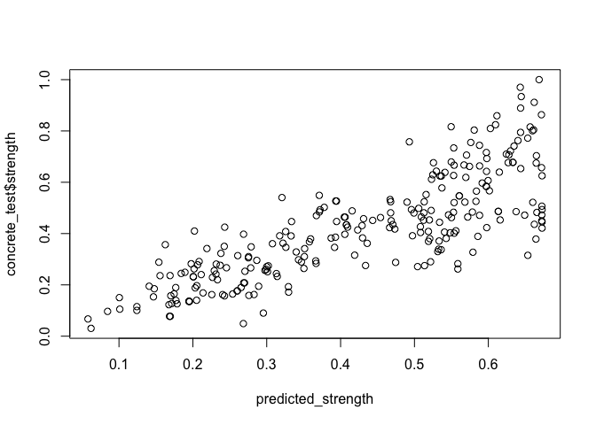
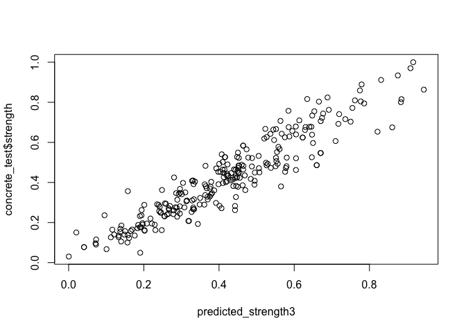

# ch_7 Black Boxes: Neural networks & SVMs
Jason Grahn

# Neural networks & SVMs

## Overview

- **black box process (hidden box)**: mechanism that transforms input to
  output is obfuscated by an imaginary box. in ML the process is what’s
  hidden inside the box because the maths are complex.

- Neural networks: mimic brain structure

- support vector machines: use multimidensional surface to define
  relationships between features and outcomes.

- **artificial neural network (ANN):** models relationship between input
  and output using stimuli from sensory inputs

  - ANNs use “nodes” to solve problems.

  - often used when the data is **well defined** yet the process that
    connect input to output are complex and difficult to define.

- Many types, with 3 main characteristics:

  - **activation function:** transforms net input signal into a single
    output signal.

  - **network topology (architecture)**: describes the number of neurons
    in the model, the number of layers, and the manner in which they’re
    connected

  - **training algo**: specifies how connection weights are set to
    reward or penalize in proportion to their signal.

### Activation functions

“The activation function is the mechanism by which the artificial neuron
processes incoming information and determines whether to pass the signal
to other neurons in the network.”

(Lantz, Brett. Machine Learning with R: Learn techniques for building
and improving machine learning models, from data preparation to model
tuning, evaluation, and working with big data, 4th Edition (p. 462).
Packt Publishing. Kindle Edition.)

In an ANN, it’s known as a *threshold activation function* because it’s
the threshold by which the neuron activates and sends an output signal.
Sometimes referred to as a *unit step activation function.* Rarely used
in ANNs

- **sigmoid activation function** (logistic sigmoid); instead of
  operating like a light switch, this allows for the output signal to
  fall on a scale of 0 to 1.

  - differentiable: possible to calculate the derivative across the
    range of inputs.

- choice of activation function biases the network to fit certain types
  of data better.

Author note: “Neural networks use nonlinear activation functions almost
exclusively since this is what allows the network to become more
intelligent as more nodes are added. Limited to linear activation
functions only, a network is limited to linear solutions and will
perform no better than the much simpler regression methods.”

- **squashing function:** when a function clips the peaks of input
  values before activating

  - solutions to squashing standardize or normalize the data in some
    way.

### Network topology

- number of layers

- direction of travel

- number of nodes in each layer

Topology determines complexity of tasks that can be learned by the
network. Power of a network is a function of the network size *and* the
arrangement.

### number of layers

- **input nodes**: a set of neurons that receives unprocessed signals
  from input data

  - each node processes a single feature in the data.

  - feature is transformed by the node’s activation function.

  - then a signal sent to the output node

- **output node**: generates a final prediction using it’s own
  activation function.

- nodes are generated in **layers**

- **multilayer network**: adds more *hidden* layers to process signals
  from input nodes

  - hidden layers are what make the hidden box hidden. knowing what
    happens here is more and more challenging the more layers that are
    added.

  - neural network with many hidden layers is called a **deep neural
    network** (DNN) and training them is called **deep learning**.

    - deep leaning is better at some tasks than others.

### direction of layers

- **filly connected**: every node in one layer is connected to every
  node in the next. common for simply multilayer networks.

- **convolutional neural networks:** only partially connected.

  - limiting connections limits overfitting.

- **feed forward network**: networks where the input signal is fed from
  input to output continuously in one direction.

- **recurrent neural network** (feedback network): network where signals
  move backwards using loops. Allows for elaborate and complex learning.

- **delay:** increases the power of recurrent networks by sequencing
  events over time (think about DAGs)

- **long short-term memory** (LSTM): a network where the model has
  longer recall into both short and long term memory.

### number of nodes

The number of *input* nodes is predetermined by the number of features
in the input data.

The number of *output* nodes is predetermined by the number of outcomes
to be modeled.

The number of *hidden* nodes is up to user discretion.

The more complex the network, the more learning that can be done to
solve the most complex problems.

- **universal function approximator:** A network with at least 1 hiddel
  later with nonlinear activation functions

## Training networks with backpropagation

- **Backpropagation**: The algo used to train an ANN, uses a strategy to
  back-propagate errors

- **Epoch:** a cycle of two processes that backpropagation iterates
  through

  - starting weights are set at random

  - **forward phase:** network is activated in sequence from input to
    output.

  - **backward phase:** the output from forward phase is compared to
    target value in training. The difference between output and true
    value produces an error which is propagated backward in network to
    modify connection weights between neurons to reduce future errors

- **Gradient Descent**: using the derivative of each neuron to identify
  the *gradient* in the direction of each incoming weight.

  - gradient suggests how steeply the error will be reduced (descent) or
    increased for a change in weight.

  - algo attemps to change the weights that result in the greatest
    reduction in error (the **learning rate**)

    - the greater the learning rate, the faster the algo will attempt to
      go down the gradient, reducing training time (at risk of
      overshooting ‘the valley’)

## Example: Model the strength of concrete

### Collect

<details>
<summary>Code</summary>

``` r
concrete <- 
    read.csv("https://raw.githubusercontent.com/PacktPublishing/Machine-Learning-with-R-Fourth-Edition/main/Chapter%2007/concrete.csv",
             stringsAsFactors = TRUE)
```

</details>

### explore

<details>
<summary>Code</summary>

``` r
concrete |> 
    psych::describe() 
```

</details>

             vars    n   mean     sd median trimmed    mad    min    max  range

cement 1 1030 281.17 104.51 272.90 273.47 117.72 102.00 540.0 438.00
slag 2 1030 73.90 86.28 22.00 62.43 32.62 0.00 359.4 359.40 ash 3 1030
54.19 64.00 0.00 46.86 0.00 0.00 200.1 200.10 water 4 1030 181.57 21.35
185.00 181.19 19.27 121.80 247.0 125.20 superplastic 5 1030 6.20 5.97
6.40 5.56 7.86 0.00 32.2 32.20 coarseagg 6 1030 972.92 77.75 968.00
973.49 68.64 801.00 1145.0 344.00 fineagg 7 1030 773.58 80.18 779.50
776.41 67.46 594.00 992.6 398.60 age 8 1030 45.66 63.17 28.00 32.53
31.13 1.00 365.0 364.00 strength 9 1030 35.82 16.71 34.44 34.96 16.20
2.33 82.6 80.27 skew kurtosis se cement 0.51 -0.53 3.26 slag 0.80 -0.52
2.69 ash 0.54 -1.33 1.99 water 0.07 0.11 0.67 superplastic 0.90 1.39
0.19 coarseagg -0.04 -0.61 2.42 fineagg -0.25 -0.11 2.50 age 3.26 12.07
1.97 strength 0.42 -0.32 0.52

Notice that those values range from zero to thousands, which makes
comparative analysis tricky.

“Neural networks work best when the input data is scales to a narrow
range around zero.” - the book.

so we’ll load up the normalize function we built a couple chapters ago..

<details>
<summary>Code</summary>

``` r
normalize <- 
    function(x) {
        return((x - min(x)) / (max(x) - min(x)))
    }

concrete_norm <- as.data.frame(lapply(concrete, normalize))
```

</details>
<details>
<summary>Code</summary>

``` r
concrete_norm |> psych::describe()
```

</details>

             vars    n mean   sd median trimmed  mad min max range  skew

cement 1 1030 0.41 0.24 0.39 0.39 0.27 0 1 1 0.51 slag 2 1030 0.21 0.24
0.06 0.17 0.09 0 1 1 0.80 ash 3 1030 0.27 0.32 0.00 0.23 0.00 0 1 1 0.54
water 4 1030 0.48 0.17 0.50 0.47 0.15 0 1 1 0.07 superplastic 5 1030
0.19 0.19 0.20 0.17 0.24 0 1 1 0.90 coarseagg 6 1030 0.50 0.23 0.49 0.50
0.20 0 1 1 -0.04 fineagg 7 1030 0.45 0.20 0.47 0.46 0.17 0 1 1 -0.25 age
8 1030 0.12 0.17 0.07 0.09 0.09 0 1 1 3.26 strength 9 1030 0.42 0.21
0.40 0.41 0.20 0 1 1 0.42 kurtosis se cement -0.53 0.01 slag -0.52 0.01
ash -1.33 0.01 water 0.11 0.01 superplastic 1.39 0.01 coarseagg -0.61
0.01 fineagg -0.11 0.01 age 12.07 0.01 strength -0.32 0.01

<details>
<summary>Code</summary>

``` r
summary(concrete_norm$strength)
```

</details>

Min. 1st Qu. Median Mean 3rd Qu. Max. 0.0000 0.2664 0.4001 0.4172 0.5457
1.0000

<details>
<summary>Code</summary>

``` r
summary(concrete$strength)
```

</details>

Min. 1st Qu. Median Mean 3rd Qu. Max. 2.33 23.71 34.45 35.82 46.13 82.60

The data has already random ordered, so (bad practice) we’ll just divide
it into two portions.

<details>
<summary>Code</summary>

``` r
concrete_train <- concrete_norm[1:773, ]
concrete_test <- concrete_norm[774:1030, ]
```

</details>

### training

i’ve installed the `neuralnet` package per the book.

We have to set the seed to control for randomization.

<details>
<summary>Code</summary>

``` r
library(neuralnet)
set.seed(12345) # to guarantee repeatable results
concrete_model <- neuralnet(strength ~ cement + slag +
                              ash + water + superplastic + 
                              coarseagg + fineagg + age,
                              data = concrete_train)
```

</details>
<details>
<summary>Code</summary>

``` r
plot(concrete_model)
```

</details>

### evaluating performance

<details>
<summary>Code</summary>

``` r
model_results <- compute(concrete_model, concrete_test[1:8])
```

</details>
<details>
<summary>Code</summary>

``` r
predicted_strength <- model_results$net.result
```

</details>
<details>
<summary>Code</summary>

``` r
cor(predicted_strength, concrete_test$strength)
```

</details>

          [,1]

\[1,\] 0.8064656

<details>
<summary>Code</summary>

``` r
plot(predicted_strength, concrete_test$strength)
```

</details>



### improvements

we only used 1 hidden node. let’s turn up the volume and see what we
get!

<details>
<summary>Code</summary>

``` r
set.seed(12345)
concrete_model2 <- neuralnet(strength ~ cement + slag +
                               ash + water + superplastic + 
                               coarseagg + fineagg + age,
                             data = concrete_train,
                             hidden = 5)
```

</details>
<details>
<summary>Code</summary>

``` r
# plot the network
plot(concrete_model2)
```

</details>

the error rate is *way* down. The step count is huge in comparison.

<details>
<summary>Code</summary>

``` r
# evaluate the results as we did before
model_results2 <- compute(concrete_model2, concrete_test[1:8])

predicted_strength2 <- model_results2$net.result

cor(predicted_strength2, concrete_test$strength)
```

</details>

          [,1]

\[1,\] 0.9244533

<details>
<summary>Code</summary>

``` r
plot(predicted_strength2, concrete_test$strength)
```

</details>


**softplus** is an activation function that’s extremely popular so let’s
try to apply that.

<details>
<summary>Code</summary>

``` r
softplus <- 
    function(x) {
        log(1 + exp(x))
    }
```

</details>

application of softplus as well as adding another layer…

<details>
<summary>Code</summary>

``` r
# to guarantee repeatable results and has to be in the same code block as the model.. 
set.seed(12345) 
concrete_model3 <- 
    neuralnet(strength ~ cement + slag + ash + 
                  water + superplastic + coarseagg +
                  fineagg + age,
              data = concrete_train, 
              hidden = c(5, 5), # 2 layers of 5 nodes
              act.fct = softplus)

# plot the network
plot(concrete_model3)
```

</details>
<details>
<summary>Code</summary>

``` r
# evaluate the results as we did before
model_results3 <- compute(concrete_model3, concrete_test[1:8])
predicted_strength3 <- model_results3$net.result

cor(predicted_strength3, concrete_test$strength)
```

</details>

          [,1]

\[1,\] 0.9348395

<details>
<summary>Code</summary>

``` r
plot(predicted_strength3, concrete_test$strength)
```

</details>



but the predictors are all normalized…

<details>
<summary>Code</summary>

``` r
strengths <- data.frame(
  actual = concrete$strength[774:1030],
  pred = predicted_strength3
)
```

</details>

it’s ok, the relationships stay the same!

<details>
<summary>Code</summary>

``` r
head(strengths, n = 3)
```

</details>

    actual      pred

774 30.14 0.2860639 775 44.40 0.4777305 776 24.50 0.2840964

<details>
<summary>Code</summary>

``` r
# correlation is unaffected by normalization...
# ...but measures like percent error would be affected by the change in scale!
cor(strengths$pred, strengths$actual)
```

</details>

\[1\] 0.9348395

<details>
<summary>Code</summary>

``` r
cor(strengths$pred, concrete_test$strength)
```

</details>

\[1\] 0.9348395

but let’s *unnormalize* them so we can better interpret them

<details>
<summary>Code</summary>

``` r
unnormalize <- 
    function(x) {
        return(x * max(concrete$strength) - 
                   min(concrete$strength)) + 
            min(concrete$strength)
    }
```

</details>
<details>
<summary>Code</summary>

``` r
strengths$pred_new <- unnormalize(strengths$pred)
strengths$error_pct <- (strengths$pred_new - strengths$actual) / strengths$actual
```

</details>
<details>
<summary>Code</summary>

``` r
head(strengths, 3)
```

</details>

    actual      pred pred_new  error_pct

774 30.14 0.2860639 21.29888 -0.2933351 775 44.40 0.4777305 37.13054
-0.1637267 776 24.50 0.2840964 21.13636 -0.1372912

# Understanding Support Vector Machines
